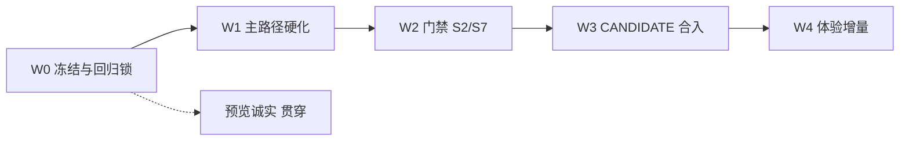

# Pico 统筹规划（写入窗执行蓝图）

```
DOC: docs/ORCHESTRATION-PLAN.md
STATUS: PLANNING — NOT A PASS
DATE: 2026-07-30
TIP_BASE: a665345… @ grok/pico-preview-librechat-p0
PLAN_LAW: docs/MVP-3DAY.md v1.2 FIXED（无授权不升 v1.3）
CALIBRATION: docs/CALIBRATION-NOW.md
GOALS: docs/CORRECTED-GOALS.md
REPO: juanwan99/pico ONLY
VERDICT_AUTHORITY: NONE
```

---

## 0. 总控原则

| 原则 | 含义 |
|------|------|
| **一条主航道** | 门禁与主路径优先；像素与扩展后置 |
| **不升计划** | 不改 v1.2 正文；本蓝图是**执行切片**，不是 v1.3 |
| **不自 PASS** | 每切片结束 = CANDIDATE 候选 + 证据；合 main 须值守 |
| **只写 pico** | 禁止 edu-cloud；禁止回潮 web/nextchat/workbench |
| **预览诚实** | 本机绿 ≠ Live Preview 绿；6014 问题单独立项 |
| **最小正确** | 每切片可演示、可回滚；禁止并行开 3 条大功能 |

**产品北极星（不变）：**  
Pico = AI 工作台底座（对话 + Agent + 产物 + **唯一 AI 账本** + 模型 API），壳 = LibreChat。

---

## 1. 现状一句

| 层 | 状态 |
|----|------|
| 壳 + 中文任务台 | 可演示 |
| Kimi 真聊 + 账本入账 | 可演示 |
| WorkBuddy 对等 | ~40% 级，非主线门禁 |
| S7 人确认 / S8 合入 | **未闭环** |
| Live Preview | **6014 常空 body**，与产品 HTML 解耦 |

分支领先 `main` 约 36 commits → **合入策略必须单独阶段**，禁止静默 squash 无审查。

---

## 2. 阶段总览（W0 → W4）



| 阶段 | 名称 | 目标 | 预估 | 退出标准（可检查） |
|------|------|------|------|-------------------|
| **W0** | 冻结与基线 | 统一记忆、锁范围、建回归清单 | 0.5 日 | CALIBRATION 已读；回归清单可勾选 |
| **W1** | 主路径硬化 | 登录→任务→产物→失败 稳定可复验 | 1–2 日 | 清单全绿（本机 8080+API）；已知预览限制写明 |
| **W2** | 门禁补齐 | S2 叙事/演示 + S7 最小确认 | 2–3 日 | 文档+一次可点演示；提案→确认→Event |
| **W3** | CANDIDATE | PR、CI、审查、值守合 main | 1–2 日 | PR 开出；CI 结果可链；**有人**合或不合有结论 |
| **W4** | 体验增量 | 像素/能力/自动化字段 | 按需 | 不回退 W1–W2 |

**edu 联调 / 定价 FIXED / 换壳** → **W4 之后或另立项**，不进本蓝图关键路径。

---

## 3. 阶段细则

### W0 — 冻结与基线（已大部分完成）

| 项 | 动作 | 状态 |
|----|------|------|
| 主线校准 | `docs/CALIBRATION-NOW.md` | ✅ |
| 过时文档降权 | HANDOFF/HAZARD/PRODUCT-UI 标记 | ✅ |
| 回归清单 | `docs/REGRESSION-MAINPATH.md`（本规划配套） | 本阶段交付 |
| 范围墙 | 本蓝图 §6 不做清单 | ✅ 本文 |

**W0 产出：** 全员同一套「做什么 / 不做什么」。

---

### W1 — 主路径硬化（下一执行窗默认开工点）

**用户可感知成功：**  
打开产品 → 登录 → 发一句 → 见回复与结果区产物 → 再发文件任务见 `hello.txt` → 故意失败见中文。

| ID | 切片 | 内容 | 验证 |
|----|------|------|------|
| W1.1 | 回归脚本/清单 | 逐步手工 + 可选 API curl 套件 | 文档勾选 |
| W1.2 | 首条 rebind | pending→真实 conversation 失败可观测 | 发首条后任务可按会话查到 |
| W1.3 | 产物 | 摘要 + 文件 fence/用户意图 | 结果区可见可打开 |
| W1.4 | 鉴权 | `/api/pico` 401；带 JWT 200 | curl + 登录后网络面板 |
| W1.5 | 构建契约 | dist 主 JS 404 → 重启/ensure | 无「永久加载中」 |
| W1.6 | 预览诚实段 | 8080 vs 6014 表 + 用户可见说明策略 | 不谎称 Live Preview |

**W1 禁止：** 新导航、新壳、大改 IA、edu。

---

### W2 — 门禁 S2 / S7

| ID | 切片 | 内容 | 退出 |
|----|------|------|------|
| W2.1 | **S2 叙事** | README/DEMO：默认 = 直连 Kimi；`pico-agent` = 多步工具环 | 文案与模型选择器一致 |
| W2.2 | **S2 演示** | 一条可重复的 pico-agent 路径（echo 或 FakeEdu） | DEMO 步骤 3 分钟内可跑 |
| W2.3 | **S7 最小** | `pico_propose_change` → UI 确认/拒绝 → Event | 审计可查；无静默写业务 |
| W2.4 | 跨校拒绝 | 已有逻辑补一条 DEMO/测试 | Event 可见 |

**W2 禁止：** 自动化九字段全做、腾讯授权、像素冲刺。

---

### W3 — CANDIDATE 与合入

| ID | 切片 | 内容 |
|----|------|------|
| W3.1 | 分支整理 | 相对 main 的变更说明（壳/API/账本/安全/文档） |
| W3.2 | PR | 标题+范围+**不做**列表；40 字 tip SHA |
| W3.3 | CI | 推 PR 后贴检查结果；红则修到绿或标注 BLOCKED |
| W3.4 | 审查包 | 预览限制、密钥、membership、危险项摘要 |
| W3.5 | 值守合 | **人工**合并；写入窗不点合 main |

**合并策略建议：**

- **优先：** 一个「产品壳 + Pico 接通」大 PR，或拆 2 个（docs/security 先合，产品后合）  
- **避免：** 无说明的 36 commit 直推 main  

---

### W4 — 体验增量（门禁后）

按收益排序，**每次只开一条：**

1. 双 Composer/状态残留扫尾（若回归复现）  
2. Run 条 token/耗时完整卡  
3. 项目资产真文件元数据  
4. 能力中心 binding（禁 DOM 桥）  
5. 自动化字段补齐 + 运行历史  
6. 像素 263/797/对比度扫尾  
7. 默认浅色与设置一致性  

---

## 4. 角色与节奏

| 角色 | 职责 |
|------|------|
| **写入窗（本角色）** | 按 W 切片实现；交 CANDIDATE；**不**发 PASS |
| **调查/审查** | 对 exact SHA 独立结论 |
| **值守** | 合 main / 拒合 |
| **业主** | 升 v1.3、定价、edu 联调授权 |

**建议节奏：** 每切片 0.5–1 日 → 短证据 → 再开下一刀；禁止「2 小时梭哈全 W2+W4」。

---

## 5. 风险与依赖

| 风险 | 缓解 |
|------|------|
| Live Preview 白屏 | 产品验收以 **8080 Playwright** 为准；6014 单独记缺陷给平台 |
| 双存储误解 | 对外叙事：Mongo=会话；Pico DB=AI 账本 |
| 代理 key 演示 | 合入前检查清单：`PICO_ENV` / 拒 sk-pico-dev 于 prod |
| 分支过大 | W3 写清；可拆 PR |
| 密钥在 .env | 不入库；泄露则轮换 |

---

## 6. 明确不做（本蓝图周期内）

- 写 / PR / 合 **edu-cloud**  
- 恢复 `apps/web` / `nextchat` / `workbench`  
- 拆 WorkBuddy 二进制  
- 无授权改 MVP v1.2  
- 无人合 main / 写入自 PASS  
- 把 API JSON 根路径当产品成功  
- 默认打开 Shell/File/Web/MCP  
- 以换壳解决 6014 白屏  

---

## 7. 决策树（执行时用）

```text
用户说白屏？
  → 先 8080 HTML 有无「Pico 正在加载/登录」？
     无 → 修产品/启动/dist
     有 → 查 6014 status/body；诚实写 Preview 层

要加功能？
  → 是否阻塞 W1 主路径或 W2 门禁？
     是 → 进当前 W
     否 → 进 W4 队列，不插队

要合 main？
  → 是否完成 W1 回归 + 安全底线？
     否 → 不开合入
     是 → W3 CANDIDATE，等人
```

---

## 8. 立刻下一步（总控指定）

**默认开工：W1.1 + W1.6**  

1. 落盘 `docs/REGRESSION-MAINPATH.md` 并在本环境跑通勾选  
2. 预览对照段写入回归文档（8080/6014）  
3. 通过后进入 W1.2–W1.5 修洞（有洞才改代码）  
4. W1 退出后开 W2.1（S2 叙事，改动小）再 W2.3（S7）  
5. 准备 W3 PR 说明草稿  

**成功度量（总控看板）：**

| 里程碑 | 标志 |
|--------|------|
| M1 | 主路径回归清单全绿 |
| M2 | S2 文档+agent 演示 + S7 一次确认流 |
| M3 | CANDIDATE PR 存在且 CI 有结论 |
| M4 | main 含产品壳（值守合入后） |

---

## 9. 给业主的三句话

1. **现在有的：** 可登录的中文任务台、真 Kimi、账本与产物雏形。  
2. **卡的：** 预览代理层白屏风险；Phase1 的人确认与正式合入流程。  
3. **接下来：** 先锁主路径与门禁，再谈 WorkBuddy 像素与 edu。  
