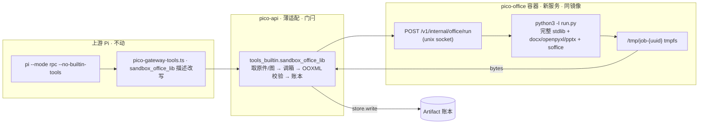

# 方案 · 办公计算机 v2：换后端不换合同 · 删自制 jail · 真模型回归门

```text
DOC: docs/PLAN-OFFICE-COMPUTER-V2.md
STATUS: 方案草案 · 待业主点头 · 未开执行卡 · 不改 CLAIM
DATE: 2026-09-08
REPO: juanwan99/pico ONLY
BASE: origin/main = 公网 tip = 8260475cf53257cbdfd589071c425fce7e649d28
LAW: LAW-NO-SELF-BUILD-THIN-ADAPTER §0-supreme（禁自制 jail · 只薄适配）
NORTH: DIRECTION-NOW §0-star v1.4（办公主线 · 工作环境交成熟上游 · 验收看减法）
FREEZE: TRUTH-FREEZE v1.9 → 本方案落地需升 v2.0（P0e 加一句，见 §8）
SUPERSEDES: PLAN-WORKENV-UPSTREAM 的「阶段车辆 = pico-api 侧受限解释器」；B1 / overlay / nft 段仍为学习账
NOT: B1 箱内 Pi builtins · 宿主 bash · 新办公动词 · 名叫 exec 的网关工具 · 采购沙箱厂商 · 写 edu
```

---

## 0. 一句话

**Pi 面上不需要 bash 这个动词；箱子里必须是一台完整的计算机。**

`sandbox_office_lib` 的工具合同（Pi 看见的名字、参数、回执）一字不动；把它的执行后端从「pico-api 进程内、Pico 自写 AST/import 白名单的受限解释器」换成「无网隔离容器里跑完整 Python 3.12 + 办公库」。**删掉全部 jail 代码**，隔离靠容器，不靠解释器。同时把 #919 的真模型夹具固化成可重复跑的回归门。

验收看减法：jail 代码归零；T1/T2/T3-files 在真模型下打开字节全过。

---

## 1. 现状诚实（代码事实 · tip 8260475c）

### 1.1 「隔离办公库」今天是什么

| 项 | 事实 | 文件 |
|----|------|------|
| 执行位置 | **pico-api 容器内** `subprocess.run([sys.executable, runner.py])`，与 JWT 签名钥、账本 SQLite、`network_mode: host` 同一进程边界 | `office/sandbox_lib.py:297` |
| 隔离手段 | AST 遍历拒 import / 拒 `exec eval compile open __import__` / 拒双下划线；子进程内再装 `__import__` 钩子、`_SAFE_BUILTINS` 白名单、`pathlib` 桩（`exists()` 恒 False）、`io` 桩、猴补 `Presentation/Document/Workbook.save` 强制落 `OUTPUT_PATH` | `sandbox_lib.py` 387 行 + `sandbox_exec.py` 413 行 ≈ **800 行自写 jail** |
| 能力上限 | 只准 `pptx / docx / openpyxl / pathlib(桩) / io(桩) + 31 个白名单 stdlib`。`os` / `subprocess` / `csv` / `pandas` / `PIL` / `matplotlib` 全拒。`Path.exists()` 永远 False，`open()` 不存在 | `_ALLOWED_IMPORT_ROOTS` · `STDLIB_OK` |
| 输入 | `artifact_id` 只认真 OOXML；CSV / TXT / JSON 原件**进不去** | `run_office_lib_source` `_looks_like_office_zip` 校验 |
| 输出 | 单文件；`save` 被猴补到固定路径 | `_ledger_save` |
| 工具说明 | 对模型写死「Do not import os. from pathlib import Path is a stub.」 | `pico-gateway-tools.ts:291` · `office/skills/*.md` |

**判定：** 这是 LAW §2 定义的「自制 jail」，也是 #919 根因 A（适配层定义行为）换层重演：每拒一个 import，就是 Pico 在替模型决定它能不能干活。它今天不厚，但方向是越修越厚（`STDLIB_OK` 已从 4 个长到 31 个）。

**安全反直觉：** 它比真容器**更不安全**。一旦 jail 被绕（Python 沙箱逃逸是已知不可靠领域），拿到的是 pico-api 进程本体：控制面密钥、账本、宿主网络。

### 1.2 现网 sidecar 已经是那台计算机

`pico-sandbox:v13`（`services/sandbox_worker/Dockerfile` · `docker-compose.host.yml:140`）：

```text
python:3.12-slim-bookworm
+ requirements.txt（含 python-docx / python-pptx / openpyxl）
+ libreoffice-writer/calc/impress · fonts-wqy-zenhei
+ Playwright Chromium（浏览器职责，本方案不动）
uid 65532 · cap_drop ALL · no-new-privileges · read_only · tmpfs /tmp · mem 512m · pids 256
鉴权 X-Pico-Sandbox-Token · 只发布 127.0.0.1:18767
```

镜像、依赖、隔离合同全部现成。**缺的只是一条「跑这段 Python、把产物字节还我」的路由，以及一个不共享 Chromium 内存、不带网络的进程壳。**

---

## 2. 目标 / 非目标

### 目标

1. **Pi 合同不变**：工具仍叫 `sandbox_office_lib`，参数 `source / kind / title / artifact_id / image_artifact_ids` 不变，回执仍是 Artifact + `observation`。老师、SYSTEM、skills 目录都不用学新动词。
2. **箱内是完整 Python**：标准库全开、`os` / `subprocess` / `csv` 可用、可调 `soffice`、可 `open()` 工作目录内文件。Pico **不维护 import 白名单**。
3. **隔离升级**：脚本跑在独立容器（无网络、无密钥、无老师盘、tmpfs 工作目录、rlimit），不再跟 pico-api 同边界。
4. **输入放宽**：`artifact_id` 接受账本里任何原件（xlsx/docx/pptx/csv/txt/json/png…），`INPUT_PATH` 保留原扩展名。T2（CSV → 表 + Word）因此可过。
5. **删代码**：`sandbox_exec.py` 整文件、`sandbox_lib.py` 的 AST/import/builtins/桩全部删除；只留 OOXML 校验、空壳门、账本写入。
6. **真模型回归门**：T1/T2/T3-files 夹具 + 内容断言 + 三个数（工具次数 / 墙钟 / 产物数）固化成脚本，部后必跑，结果贴 Issue。

### 非目标（本方案明确不做）

- 不重开 B1（箱内 Pi 带 builtins）；宿主 Pi 永 `--no-builtin-tools`。
- 不给 Pi 注册 `bash` / `exec` / `run_python` 一类通用动词；模型只看见办公工具。
- 不加 `batch_edit_xlsx` 等新专用动词；不加厚 spec。
- 不采购 E2B / Daytona；不自研微 VM。
- 不做多输出、工作区持久化、跨轮文件系统（见 §9 开放问题，Pass 后另议）。
- 不写 edu-core / edu-cloud。

---

## 3. 设计

### 3.1 三层不变，只换最底一格



- **Pi 层**：只改 `sandbox_office_lib` 的自然语言描述（去掉「Do not import os / pathlib 桩」，改成「完整 Python，工作目录可读写，产物写到 `OUTPUT_PATH` 或工作目录」）。
- **Pico 层**：`_make_sandbox_office_lib` 逻辑不变：取原件字节、取图字节 → **HTTP 调箱** → `_validate_office_bytes`（OOXML 合法 + 空壳门，**保留**）→ `store.write` → `observation`。`run_office_lib_source_async` 内部从「本地 subprocess」换成「箱客户端」。
- **箱层**：新增。见 3.2。

### 3.2 `pico-office` 服务（同镜像 · 第二个 service）

```yaml
# docker-compose.host.yml 新增（prod-update 读）
pico-office:
  image: pico-sandbox:v13            # 同一镜像，不新建
  command: ["python", "-m", "sandbox_worker.office_runner", "--uds", "/run/pico-office/office.sock"]
  network_mode: none                 # 箱内零网络：打不到 18765 / 3000 / metadata / 公网
  user: "65532:65532"
  cap_drop: [ALL]
  security_opt: ["no-new-privileges:true"]
  read_only: true
  tmpfs:
    - /tmp:size=1g                   # 工作目录
  volumes:
    # Host bind. Named volume pico_office_sock is forbidden: dockerd
    # creates those root:755 and uid 65532 cannot bind the socket.
    - ${PICO_OFFICE_SOCK_HOST:-./data/pico-office-sock}:/run/pico-office
  mem_limit: 1g                      # 不与 Chromium 共享 512m（PLAN-WORKENV 明令）
  pids_limit: 128
  environment:
    PICO_SANDBOX_TOKEN: ${PICO_SANDBOX_TOKEN:-}
```

pico-api 挂同一宿主目录，用 `httpx.AsyncHTTPTransport(uds="/run/pico-office/office.sock")` 调用。**箱没有网卡**，pico-api 靠 unix socket 进去；这是 uvicorn 原生 `--uds`，不是自研运输。

目录合同：`prod-update.impl.sh` 在 `compose up` **之前**建该目录，mode **1777 sticky**（会合点，同类 `/tmp`）。宿主 ops 无 CAP_CHOWN，不能 `chown 65532`，禁止假装已 chown。禁止命名卷；遗留 `pico_*_office_sock` 必须删掉，不能复用。

为什么不直接塞进现有 `pico-sandbox`：那个容器要给 Chromium 出网，且 512 MiB 已被浏览器占；`PLAN-WORKENV-UPSTREAM` 已写「把 Pi/办公塞回同一 512MiB = Fail」。同镜像双服务，成本是一段 compose。

### 3.3 路由合同 `POST /v1/internal/office/run`

```text
请求（JSON · X-Pico-Sandbox-Token）
  kind:        "docx" | "xlsx" | "pptx"
  source:      str                    # 模型写的 Python，上限沿用 OFFICE_LIB_MAX_SOURCE
  input:       { name: str, b64: str } | null      # 原件，任何类型，保留扩展名
  images:      { key: {name, b64} }               # image_artifact_ids 解出的像素
  timeout_s:   number（默认 60，上限 180）

响应
  ok:          bool
  output_b64:  str | null             # 见「收集规则」
  output_name: str | null
  stdout_tail: str（≤ 4 KB）
  stderr_tail: str（≤ 4 KB）
  exit_code:   int
  wall_ms:     int
  files:       [ {name, bytes} ]      # 工作目录终态清单（诊断用，不回传字节）
```

**箱内执行（`office_runner.py` · 目标 ≤ 150 行）：**

```text
job = /tmp/job-{uuid4}                      # 每次调用独立目录，结束 rm -rf
写入: run.py(用户 source) · pico_prelude.py · pptx_helpers.py · in.{ext} · img_*.png
环境: 只给 PATH HOME=/tmp/job LANG PYTHONDONTWRITEBYTECODE=1 PICO_JOB=/tmp/job
        不给 PICO_SANDBOX_TOKEN、不给宿主任何 env
进程: subprocess.run(["python3", "-I", "run.py"], cwd=job, timeout,
        preexec_fn=setrlimit(RLIMIT_AS≈768MiB, RLIMIT_NPROC=32, RLIMIT_FSIZE=200MiB, RLIMIT_CPU=timeout))
收集: OUTPUT_PATH 存在 → 用它；否则工作目录里最新的 *.{kind} → 用它；否则 ok=false, code=sandbox.no_output
清理: 无论成败 rm -rf job
```

`pico_prelude.py`（模型脚本开头 `from pico_prelude import *`，由 run.py 自动前置注入）只做**便利**，不做**限制**：

```python
INPUT_PATH, OUTPUT_PATH, IMAGE_PATHS, KIND         # 常量
def load_doc()/load_book()/load_deck()              # = Document(INPUT_PATH) 等
def save_doc(x)/save_book(x)/save_deck(x)           # = x.save(OUTPUT_PATH)
from pptx_helpers import add_title_slide, add_content_slide, add_table   # 现有帮手照旧
```

没有猴补、没有 `__import__` 钩子、没有 `_SAFE_BUILTINS`。模型写 `prs.save("out.pptx")` 也行——收集规则兜住。

### 3.4 Pico 侧保留的门闩（这些才是 Pico 该做的）

| 门 | 保留 | 位置 |
|----|------|------|
| OOXML 合法 + 空壳门（空 PPT / 空 Excel / 无正文 Word 不装绿） | ✅ | `_validate_office_bytes` |
| 租户：原件与图只能取本 `principal` 的账本行 | ✅ | `_office_lib_input` / `_office_lib_images` |
| 文件名禁密钥词 | ✅ | `deny_secret_filename` |
| source 上限 20 万字 | ✅ | `_required_text(maximum=)` |
| 账本唯一写口 = pico-api；箱不写账本 | ✅ | 箱只回字节 |
| 用量 `kind=sandbox` + `wall_ms` | ✅ | `record_usage_event` |
| `observation` 回执（页数/单元格/段落事实） | ✅ | `_attach_write_observation` |
| 失败人话：`stderr_tail` 原样进错误消息（模型能自己修脚本） | 新增 | `sandbox.{kind}_failed` |

**删除的门（不是 Pico 该做的）：** AST 白名单、import 钩子、builtins 白名单、pathlib/io 桩、`save` 猴补、`_DENIED_CALLS`、双下划线检查。

### 3.5 安全对照（今天 vs v2）

| 维度 | 今天（pico-api 内 jail） | v2（pico-office 容器） |
|------|--------------------------|------------------------|
| 与控制面密钥同边界 | **是**（同容器） | 否 |
| 与账本 SQLite 同边界 | **是** | 否 |
| 网络 | 宿主网络（jail 拒 import 是唯一屏障） | `network_mode: none`，无网卡 |
| 老师盘 | pico-api 能读 | 不挂载 |
| 文件系统 | 宿主容器 FS（靠桩挡） | `read_only` + tmpfs 工作目录，用完即删 |
| 资源 | 仅 45s 超时 | mem 1g · pids 128 · rlimit AS/NPROC/FSIZE/CPU · 超时 |
| 逃逸后果 | 拿到 pico-api 进程 | 拿到一个无网、无密钥、无盘、即将被删的 tmpfs |
| Pico 维护的安全代码 | ~800 行自写 | 0 行（合同在 compose + rlimit 十几行） |

---

## 4. 减法清单（验收锚点 · 只减不增）

| 项 | 动作 |
|----|------|
| `office/sandbox_exec.py` | **删除整文件** |
| `office/sandbox_lib.py` | 删 `assert_office_lib_source` 的 AST 遍历、`_ALLOWED_IMPORT_ROOTS`、`STDLIB_OK`、`_DENIED_CALLS`、`_pathlib_import_ok`、`_io_import_ok`、`_isolated_env`；`run_office_lib_source` 改为箱客户端；保留 `normalize_office_kind`、`_validate_office_bytes`、`_looks_like_office_zip`、`_xlsx_has_cell` |
| `office/pptx_helpers.py` | 不动（搬进箱作为普通模块） |
| `tools_builtin.py` `_office_lib_input` | 放宽：任何账本原件；保留扩展名；OOXML 校验只对 `kind` 同类原件做 |
| `pico-gateway-tools.ts` `sandbox_office_lib` 描述 | 改写：完整 Python；`INPUT_PATH`/`OUTPUT_PATH`/`IMAGE_PATHS`；产物写 `OUTPUT_PATH` 或工作目录；失败看 stderr 自己修 |
| `office/skills/{docx,xlsx,pptx}.md` | 删「Do not import os / Do not use a shell / pathlib 桩」句；加「工作目录可读写，可 `import csv/os`，可用 `soffice` 转格式」 |
| `agent_assets/system.md` | 若有「禁 import os」字样一并删 |
| `sandbox_workspace_exec`（parse-only，`executed=false`） | **从网关与 CORE 移除**（#919 H4 的诚实结局：有真执行了，假执行退场） |
| 测试 | 删 `test_ppt_sandbox_lib_no_bash.py`、`test_ppt_image_in_deck_no_bash.py` 中所有「import 被拒」断言；`test_office_sandbox_lib.py` 改为 mock 箱客户端 + OOXML 校验；新增 `tests/unit/test_office_runner.py`（收集规则、rlimit、超时、清理、无网） |
| 文档 | ADR-OFFICE-DOC-PIPELINE 「天花板」句加「隔离容器完整 Python」；TRUE-PI-BRIDGE-DUTIES 现行原则加一行；PLAN-WORKENV-UPSTREAM 文首指向本文 |

**行数目标：** 删 ≈ 800（jail）+ ≈ 100（workspace_exec）；增 ≈ 150（office_runner）+ ≈ 40（客户端）+ ≈ 15（compose）。净减 ≥ 600 行。

---

## 5. 真模型回归门（第二项 · 与第一项同卡）

#919 §7 已指出：CI 全是 FakeTransport，没有一条真业务链是必过门。本项把 #919 用过的夹具固化。

### 5.1 夹具（冻结 · 开工前贴 Issue · 不得为分数改题）

| ID | 输入 | 老师原话（不焊 Skill、不焊「必须交文件」） | 打开断言 |
|----|------|--------------------------------------------|----------|
| **T1a** | `gradebook.xlsx`（姓名/平时/期末/总分，6 行，D 列空） | 把 D2:D7 写成期末40%加平时60%的公式，保存为 xlsx。 | `ws["D2"].value` 以 `=` 开头且含 `B2`/`C2`；6 格全有公式；A1:C7 原值不变 |
| **T1b** | T1a 产物（同 conversation，新 run） | 把标题改成「三年二班成绩」，D 列公式别丢。 | 标题变；D2 仍是公式；session 仍是同一 `pico.jsonl` |
| **T2** | `roster.csv`（姓名,学号,组别，10 行） | 用这个 CSV 做两份东西：1) 按组别汇总人数的 xlsx；2) 一页说明 Word，点名各组人数。不要网页。 | xlsx 有各组计数且 = CSV 实际；docx 正文含每组名 + 人数且与 xlsx 一致 |
| **T3** | 无 | 做一页离线可开的 HTML 介绍潮汐，再做一个 3 页的 PPT 提纲。 | HTML 无 http(s) 外链；pptx ≥ 3 页、标题非空 |
| **T4** | T1a 开跑后 Stop | — | 无新 Artifact；`run.status=cancelled`；箱内无残留 job 目录 |

**三个数（每题记录，不是 Pass 条）：** 工具调用次数 · 墙钟 · 产物数。#919 基线：T1a 类任务 10 次 / 97s / 7 份。v2 预期：≤ 3 次 / 1–2 份。

### 5.2 跑法（薄 · 不建第二评测平台）

```text
scripts/office-regress.py
  --base http://127.0.0.1:18765        # 生产 loopback 或 staging
  --school test-school --member regress # 合成租户（不动真实老师）
  --fixtures testdata/office-regress/  # 上表文件
  → 走 /v1/chat/completions 真模型（New API），拉账本产物，openpyxl/python-docx 打开断言
  → 输出 JSON：每题 pass/fail + 三个数 + 产物 sha256
  → 人贴 Issue 评论（不进 PR、不进 docs）
```

- **不进 PR CI**（需要 New API 钥、真模型、约 5 分钟）。CI 仍 FakeTransport 守合同。
- **部后必跑**：本窗 prod-update 后跑一遍贴 Issue，才算过门。
- **可选夜跑**：controller-bot 已有 cron 壳；接一条即可，不做大盘。

---

## 6. Pass / Fail

**Pass（同时满足）：**

1. §4 减法清单全部落地；`grep -r "_SAFE_BUILTINS\|_ALLOWED_IMPORT_ROOTS\|_sandbox_import" services/` 为空。
2. T1a / T1b / T2 / T3 / T4 在真模型（现网同一 resolve）下全过，打开字节断言通过。
3. 箱内无网：`office_runner` 单测 `socket.create_connection(("172.17.0.1",18765))` 抛 `OSError`；`urllib.request.urlopen("http://127.0.0.1:18765")` 同。
4. 逃逸回归：脚本 `open("/run/pico-office/office.sock")` 只读到 socket、无老师盘路径、`os.environ` 无 `PICO_*`/`*_KEY`/`*_TOKEN`。
5. 三个数已记录贴 Issue；T1a 工具调用次数 ≤ 基线一半。
6. 公网 tip = origin/main；老师在 pico.aivia.asia 上做 T2 原话，拿到能打开的两份文件。

**Fail（任一即停，回到讨论）：**

1. 不加新动词、不改 SYSTEM 就完不成 T2。
2. 为了让某题过而在箱内重新加 import 限制。
3. 箱能打到 18765 / 3000 / 公网 / 老师盘，或 env 泄露任何 token。
4. 回归脚本长成第二评测平台（> 300 行、自带 UI、自带存储）。
5. `generate_*` / `sandbox_pptx_lib` 以任何别名回流。

---

## 7. 风险

| 风险 | 严重度 | 缓解 |
|------|--------|------|
| unix socket 目录权限（pico-api 是 host 网络容器，需能读写该目录） | P1 | **禁止命名卷**。宿主绑定 `PICO_OFFICE_SOCK_HOST`；prod-update impl 在 up 前建 1777 sticky；不可写且非空则失败闭合；启动探活 `GET /health`（exit 11） |
| 冷启动：每次 `python3 -I` + import openpyxl/pptx ≈ 1–2s | P2 | 可接受；远低于今天多轮工具往返。不做常驻解释器池（那是自研） |
| tmpfs 1g 被大文件撑满 | P2 | `RLIMIT_FSIZE` 200MiB + 上传 20 万字上限 + job 结束必删 |
| 模型开始 `import pandas` 而镜像没有 | P2 | 首版镜像加 `pandas` `Pillow` `matplotlib`（成熟 PyPI，办公常用；见 §9 Q2）；没有的库让 `ModuleNotFoundError` 原样回模型，它会改写 |
| soffice 在箱内被并发调用吃内存 | P2 | `pids_limit 128` + `mem_limit 1g`；超了 exit 非 0，人话失败 |
| 有人把 `/office/run` 再包一层给 Pi 叫 `run_python` | **P0** | 本方案明令禁止；网关白名单不加新名；审查红线 |
| prod-update 改 compose 引入新 service 需重建/拉镜像 | P1 | 同镜像 `pico-sandbox:v13`，只加 service；prod-update 已处理 compose 变更 |

---

## 8. 冻结升版（TRUTH-FREEZE v1.9 → v2.0 · 随 PR-A）

**P0e 加一句（不改其余）：**

> 「不要 bash」= 不给模型宿主 shell、不开宿主 Pi builtins、不给 Pi 注册通用执行动词。**隔离容器内跑完整 Python + 办公库是天花板执行层，不算 bash。Pico 不维护 import 白名单 / AST jail；隔离靠容器合同（无网、无密钥、tmpfs、rlimit），不靠解释器。**

**C1 / C9 / C10 对应收窄：** 「自制 jail」明确包含「pico-api 进程内受限解释器」；「隔离办公库」定义改为「pico-office 容器」。

**LAW §2 加第 15 条：** 「解释器级沙箱当隔离核：AST 白名单、`__import__` 钩子、builtins 白名单、stdlib 桩冒充隔离。隔离交容器/成熟上游；Pico 只做合同与门闩。」

同 PR 顺手钉死 §五 提到的过期句：HANDOFF-WB-PI「模型 = DeepSeek」、WHAT-IS §5「六条阶段二」、PHASE3「deferred」——各加一行 OVERRIDE 指向 STATE-NOW / 本文。

---

## 9. 请业主拍板（未拍前不开实现卡）

| Q | 问题 | 我的默认 |
|---|------|----------|
| Q1 | 是否同意「换后端不换合同」路线（否决 B1、否决维持 jail） | **是** |
| Q2 | 箱镜像是否加 `pandas` / `Pillow` / `matplotlib`（成熟 PyPI，Excel 汇总与图表进 Word/PPT 常用） | **加**；不加 numpy 以外的科学栈，不加 requests（无网也没用） |
| Q3 | `sandbox_workspace_exec`（parse-only 假执行）是否随本卡从网关移除 | **移除** |
| Q4 | 单次调用单产物合同是否保持（T2 让模型调两次） | **保持**；多产物 Pass 后另议 |
| Q5 | 回归门是否接夜跑（controller-bot cron 一条） | **接**，但本卡只交脚本 + 首次证据 |
| Q6 | 内存预算 1 GiB / 超时 60s（上限 180s） | **是** |

---

## 10. PR 计划（同时 OPEN ≤ 1 · 每张合了必部）

| 序 | PR | 内容 | 过门 |
|----|----|------|------|
| **A** | `docs: office computer v2 plan + TRUTH-FREEZE v2.0` | 本文进仓；FREEZE v2.0（§8）；PLAN-WORKENV 文首指针；过期句 OVERRIDE；freeze-pin 单测升版 | CI 绿 · 部 · tip = main |
| **B** | `feat: office python runs in pico-office container; delete interpreter jail` | `sandbox_worker/office_runner.py` + compose service + `sandbox_lib` 换客户端 + `_office_lib_input` 放宽 + TS/skills/SYSTEM 描述 + §4 全部删除 + 单测 | CI 绿 · 部 · 手跑 T1–T4 真模型贴 Issue · 老师路径公网抽测 |
| **C** | `test: office real-model regression script + fixtures` | `scripts/office-regress.py` + `testdata/office-regress/` + 首份三个数证据 | 脚本在生产 loopback 跑通，结果贴 Issue；可选接夜跑 |

B 与 C 若本窗顺手可合成一张（同层薄适配并一张，卡面四行不变）。A 必须先于 B（目标句先变，代码才动）。

**卡面草案（B · 供开卡）：**

```text
结果：sandbox_office_lib 在 pico-office 无网容器跑完整 Python；jail 代码归零；T1/T2/T3 真模型打开字节过
不准：注册 bash/exec/run_python 动词 · 箱内加 import 限制 · 新办公动词 · 改 edu · 自签 PASS
过门：公网 pico.aivia.asia 老师原话 T2 拿到能打开的 xlsx + docx；三个数贴 Issue；grep jail 为空
部署：合了必部；tip = origin/main
```

---

## 11. 参考

- 根因讨论 #919（借了 loop 没借 computer；根因 A/B/C）
- 北极星 #744 · 六刀 #805 · 沙箱长远 #505
- `docs/PLAN-WORKENV-UPSTREAM.md`（B1 / overlay 学习账 · 本文接替其阶段车辆）
- `docs/ADR-OFFICE-DOC-PIPELINE.md` · `docs/TRUE-PI-BRIDGE-DUTIES.md` · `docs/SANDBOX-S1.md` · `docs/SANDBOX-S2.md`
- 代码：`office/sandbox_lib.py` · `office/sandbox_exec.py` · `tools_builtin.py:_make_sandbox_office_lib` · `services/sandbox_worker/{Dockerfile,app.py}` · `docker-compose.host.yml:140`
