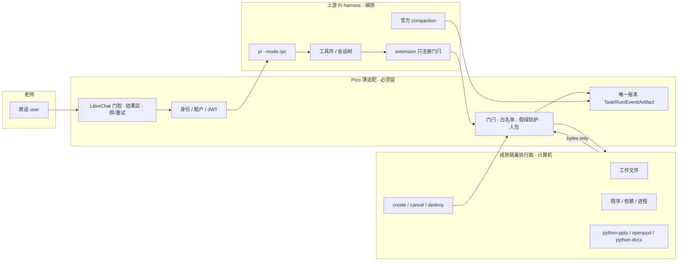
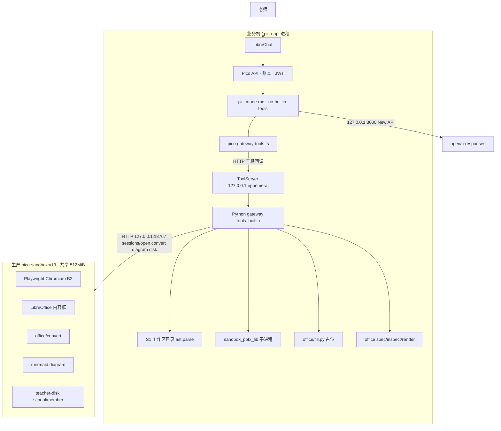
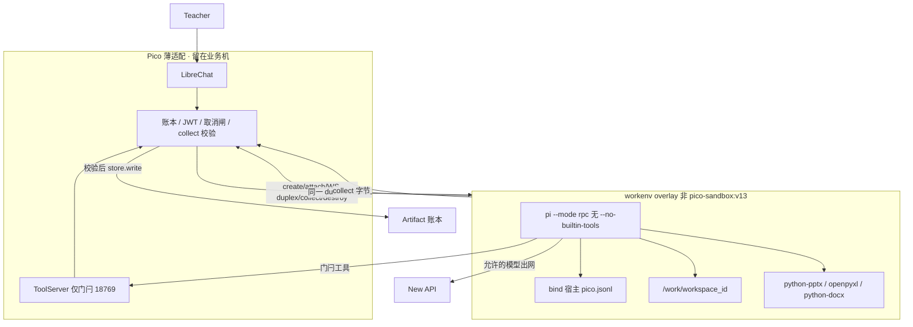
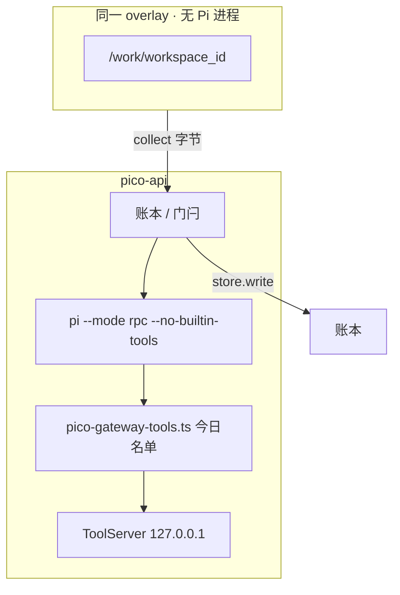
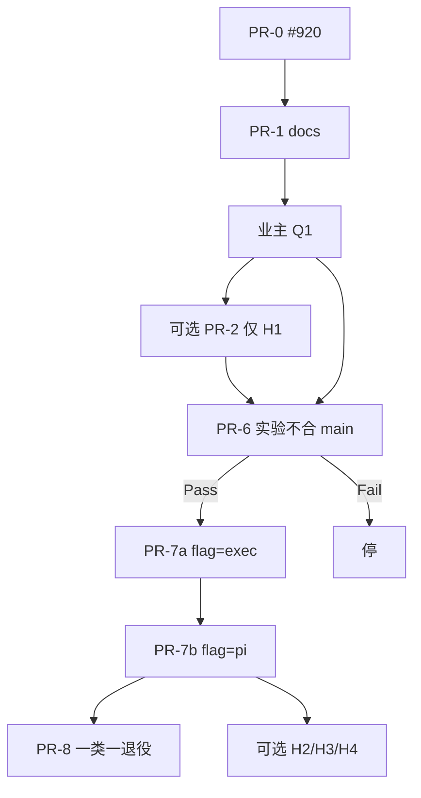

# Pico 阶段方案：成熟上游接管工作环境 · Pico 只做薄适配

```text
DOC: Pico stage plan · mature upstream takes the work environment
STATUS: BINDING stage plan · 2026-09-05 · PR-0 (#920) already live; this file is PR-1
DATE: 2026-09-05
AUTHOR: Grok (本窗)
REPO: juanwan99/pico ONLY
ISSUE: https://github.com/juanwan99/pico/issues/919 （OPEN 讨论 · 本方案是书面落地，不是再辩论）
NORTH: docs/DIRECTION-NOW.md §0-star v1.3 · PR #920 MERGED · origin/main + live tip SHA 61d6a9c87157fd896a545f8ef3db646635052bbb
LAW: docs/LAW-NO-SELF-BUILD-THIN-ADAPTER.md §0-supreme
FREEZE: docs/TRUTH-FREEZE.md v1.6 已在 origin/main / live（2026-09-05 prod-update）
CLAIM-WB: 本方案不改签
NOT: 采购 E2B · 加 Excel 批改 API · 换 Pi / LibreChat · 自研沙箱核 · 生产改动
```

---

## Overview

**一句话目标：** 把「文件、程序执行、依赖、进程生命周期」从 Pico 自建协议里交还给成熟上游隔离环境；Pi 继续做编排核；Pico 只留身份授权、唯一账本、产品对象、交互与交付门闩。验收看减法，不看再加一个专用动词。

北极星真源是 DIRECTION-NOW §0-star **v1.3**（PR [#920](https://github.com/juanwan99/pico/pull/920) **MERGED** 2026-09-05，SHA `61d6a9c87157fd896a545f8ef3db646635052bbb` = `origin/main` = 公网 tip）。v1.3 现已是 live Binding。**产品减法尚未发生**：无 overlay、无 `PICO_WORKENV`、无藏 L 后 T1/T2。禁止把北极星升版说成 computer 已迁走。

宏观根因已在 #919 调查里钉死：**Pico 借了 Pi 的 loop，没借 Pi 的 computer。** 专用办公动词、Skill 裁剪、TS schema、Python 实现、`SYSTEM.md`、import hook、llm-pass 共同定义了行为。本阶段不修 Excel 批改、不换核、不买厂商。主假设是接线 **B1**（sidecar **拥有** `pi --mode rpc` 进程；pico-api 只做 JSONL 薄附着 + 账本门闩）；A 是对照（Pi 留 pico-api，工作目录在 overlay 箱）。计算机复用 S1/S2 **隔离合同**，不复用生产 `pico-sandbox:v13` 那张 512MiB Chromium 镜像。减法失败就停。

---

## Background & Motivation

### 版本诚实（2026-09-05 写方案时）

| 指针 | SHA / 状态 | 含义 |
|------|------------|------|
| 公网 tip（PR-0 部完） | `61d6a9c87157fd896a545f8ef3db646635052bbb` | `curl -fsS https://pico.aivia.asia/api/pico/tip` |
| `origin/main` | 同 SHA | 生产线。DIRECTION-NOW v1.3 + TRUTH-FREEZE **v1.6** |
| PR #920 | MERGED 2026-09-05T06:26:17Z | squash。docs + freeze-pin 单测 v1.5→v1.6。无运行时 |
| 在飞产品 PR | 无（OPEN=0） | 下一步才开 PR-1 方案进仓 |

### 为什么现在写方案（不再辩论）

#919 已代码证明三处根因。本方案把它们当事实，不当待修 bug 清单。

**根因 A — 适配层定义了 Excel 行为。**  
Pi 描述写 `cell/value or values`（`pico-gateway-tools.ts` `generate_xlsx_document`；`tools_builtin.py` Python description 同步）。TS schema **没有** `values` 字段，但 `{ additionalProperties: true }`。Python `values` 走 `office/fill.py` 的 `{{key}}` 占位替换，不是批量单元格 API。`edit_xlsx`（`tools_builtin.py`）只要传入 `values` 就回 `edited=true, filled=true`，即使一个 `{{key}}` 都没命中。现网样本：6 个格子、10 次工具调用、约 97s、7 份产物，最后才对。这是专用动词当天花板的现场，不是「缺一个 batch Excel API」。

**根因 B — Skill 当了权限裁剪器。**  
`capability_loading.py`：CORE 17 工具，EXTENDED 11 工具。`publish_html_page` / `verify_document` 在 EXTENDED。默认调 `publish_html_page` → `tool.not_allowlisted`。`skill-deliverable`（`skill_policy.py`）放出 publish/verify，但 **去掉** `web_search` / `web_fetch` / `ask_user`，违反 ADR-CAPABILITY-LOADING「Skill 只能收窄」。

**根因 C — 不是所有 sandbox 都是假的。**  
`sandbox_workspace_exec` → `sandbox_s1.light_exec_source`：`ast.parse`，回 `executed=false`。`sandbox_pptx_lib` → `office/sandbox_lib.py` + `office/sandbox_exec.py`：受限 python-pptx 真跑，产物入账本。不能用「sandbox 全假」当叙事。

**反例（不要推倒重来）：** 读文件、同会话续改可用；默认不再靠关键词硬挂交付 Skill。**禁止**推荐换 Pi 或 LibreChat。

**架构一句话：** `true_pi/client.py` `spawn_command()` 固定 `--no-builtin-tools`。公网多租户拿不到 Pi 内建 bash/FS。Pico 用 extension `pico-gateway-tools.ts` 把白名单工具回调到 127.0.0.1 Python gateway。于是「计算机」落在 Pico 适配层，而不是隔离环境。

Codex 后来同意主线：成熟上游接走职责 → 验证能否减少 Pico 自建 → 再决定留什么、退役什么。两条候选接线：

- **A（对照）：** Pi 留在现位；工具回调远程执行环境。
- **B（主假设）：** Pi + 工作文件 + 执行工具同隔离。

业主令：「按你的建议写方案」。本文件就是那份方案。

---

## Goals & Non-Goals

### Goals

1. 把工作环境职责从 Pico 专用协议迁到成熟隔离执行面。复用 S1/S2 **隔离合同**（键、token、destroy、web_guard、非特权）；**计算机进程** = `docker-compose.workenv-poc.yml`，**不是** 生产 `pico-sandbox:v13`。不采购。
2. 编排继续用上游 Pi：RPC loop、session JSONL、官方 compaction、extension、隔离内文件原语。pico-api 仍跑 `TruePiRpcClient`；只换运输（`AttachTransport` 双工附着）。
3. 用同一模型、同一冻结夹具验证 **B1**，再用 A 做对照。**Pass = 藏名单 L 后 T1 与 T2 仍能完成。**
4. 产品承诺与诚实上限写死，避免本阶段被 PPT 设计师级 / 站点代登 / API 重启中途续跑绑架。
5. 可选 P0 卫生（假绿回执、Skill 只收窄、publish 可达）可独立合，但 **不是** 架构赌注。

### Non-Goals（本阶段明确不做）

- 替换 Pi 或 LibreChat。
- 公网 **宿主机** bash / 任意 FS（B1 箱内 Pi builtins ≠ 本条）。
- PoC 把 18769 绑 `0.0.0.0` 或给 ECS 公网 NIC。loopback 发布走宿主 nft DNAT / socat，见「发布器」。
- 魔法 `extra_hosts: "host-gateway:host-gateway"`（Engine HostGatewayIP = docker0）。箱内该名必须钉 `pico-workenv` inspect Gateway。
- 把 `pico_workenv*` nft 装上 live `pico.aivia.asia` ECS，或给宿主 FORWARD 设 **policy drop**（会杀生产 `pico-sandbox` Chromium / 其它 compose NAT）。
- 箱内直打 `host-gateway:3000`（New API 无发布器；模型只走 18769 代理）。
- 用 unary `POST prompt` 冒充 Pi stdin/stdout 双工（plan HITL 需要同一条活流）。
- 箱内 Pi 挂 `PI_MEMORY_DIR` / memory extension（本阶段 memory 仍只在宿主 A 路径）。
- 自研 agent OS、第二编排核、第二账本、自研沙箱微 VM。
- Skill 商店 / MCP 市场 / 连接器摊子。
- 现在就签 E2B / Daytona / Firecracker 采购。
- 加 `batch_edit_xlsx` 一类专用动词当「进步」。
- 把 live 说成 main；PR 正文写 GitHub 关卡关键字。
- 设计师级 PPT、模型代登站点、API 重启后从工具中途 resume。
- 改 edu-cloud / edu-core。

---

## 产品承诺 vs 诚实上限

对标 WorkBuddy **Web 六条** 仍有效，但本阶段不签 CLAIM-WB。用法 = Grok（DIRECTION-NOW §0-star v1.3）。

### 必须有（must-have）

| # | 承诺 | 验收形状 |
|---|------|----------|
| M1 | 老师原话是 user；系统纪律在 `SYSTEM.md`；没点名不交件 | `true_pi/runtime.py` `_compose_prompt` 只留原文；禁止焊「必须交 N 个文件」 |
| M2 | 多步真干活，过程进唯一账本 | Pi RPC 事件 → `true_pi/events.py` → Task/Run/Event/Artifact |
| M3 | 要文件则真 OOXML/HTML，打开能用；`ok` 不是完成 | 打开字节，不信回执字段 |
| M4 | 同会话可续改（基础） | 宿主 `{school}/{conversation}/pico.jsonl` bind 进 overlay；T1 第二轮新 `run_id` |
| M5 | 能停：进程停、产物归属清楚、终态可解释 | 单闸 cancelling → abort → SIGTERM → 拒 Artifact → destroy |
| M6 | 租户 fail-closed | `isolation_key = school_id + membership_id + run_id`；跨账号 404 |
| M7 | 搜索/问答若是产品能力，默认可见；Skill 不得阉割 | CORE 已含 `web_search`/`web_fetch`/`ask_user`；Skill 只能 ⊆ |
| M8 | 发布若是产品能力，默认可达 | `publish_html_page` 不得藏到必须先挂 Skill |

### 本阶段诚实不做（acceptable limits）

| # | 上限 | 依据 |
|---|------|------|
| L1 | **API/进程重启后不从工具中途 resume** | `docs/RESEARCH-RUN-SURVIVE-RESTART.md` 选 B1 drain + B3 人话重跑；B2 完整 resume 不做。`ADR-DURABLE-RUN.md`：deploy 孤儿标 failed，用户续跑/retry |
| L2 | **模型不代登站点、不持有站点 Cookie 当真源** | SANDBOX-S2：B2 人在环；B3 OUT；Cookie 只在 sidecar tmpfs，随 destroy/TTL 死 |
| L3 | **设计师级 PPT / SmartArt / VBA / 动画不承诺** | ADR-OFFICE-DOC-PIPELINE：天花板 = Claude/Codex 文档 skill 档，不是 Word 内 Copilot |
| L4 | **不是一人一机云桌面** | S1/S2：数据租户隔离，不是每校 VM |
| L5 | **不对宿主机开放** Pi 内建 bash/read/write/edit | ADR-PI-TRUE-KERNEL-RPC：宿主 `--no-builtin-tools` 永在。B1 箱内 builtins 另见 jail |
| L6 | **未完成复用验证前，不认定某一家执行厂商** | TRUTH-FREEZE v1.6 P0d / C1 |

---

## Duty map（职责图）

进度 = 哪一段成熟方案接走职责、Pico 能否少维护行为。加一个万能 `exec` 而旧定向协议照旧 = 不算进步。



箱 **不得** `store.write`。唯一账本写口仍是 pico-api（`tools_builtin.py` / collect 门闩）。图上 `Iso → bytes → Latch → Ledger`，禁止 `sandbox_worker` 插 Artifact 行。

| 职责 | 上游 / 模块 | Pico 允许做 | Pico 禁止做 |
|------|-------------|-------------|-------------|
| **编排** | `@earendil-works/pi-coding-agent@0.84.4` RPC sidecar | spawn、JSONL、`abort`、事件映射、白名单回调 | 自研 loop、自研 compaction、第二会话树 |
| **会话** | Pi `--session` jsonl + 官方 compaction | 按校/会话落 `pico.jsonl`；`settings.json` 只写官方 knobs | Pico 自定 reserve 截短上游窗（硬帽截窗） |
| **系统纪律** | Pi `SYSTEM.md` | `pico_system_text()` 写 agent home / `.pi/SYSTEM.md` | 把 Skill/Landing/「必须交 N 文件」焊进 `prompt()` |
| **工具面** | Pi extension 机制 | `pico-gateway-tools.ts` 只注册白名单；`PICO_TRUE_PI_VISIBLE_TOOLS` 收窄 | 自研 tool_search；公网 bash |
| **文件原语** | 隔离环境内的 read/write/list/exec | 账本投影、跨租户拒绝、产物回传 | 在 pico-api 进程里当「计算机」；文件在宿主机与模型之间来回摆渡当主路径 |
| **办公库** | PyPI `python-docx` / `python-pptx` / `openpyxl` | 捷径 `generate_*` / inspect / 按地址薄改；库在隔离内跑 | 把 spec 焊成天花板；每来一种任务加一个工具；模型在宿主机即兴写 python-docx |
| **隔离 / 生命周期** | S1/S2 **合同**（键、token、web_guard、非特权）。计算机进程 = workenv **overlay**，不是 `pico-sandbox:v13` | HTTP 薄客户端、TTL、destroy、用量 `kind=sandbox` | 自研微 VM；把 Pi 塞进 512MiB Chromium 箱；host Chrome |
| **身份 / 账本 / 门脸** | Pico | JWT、租户、Artifact、S7、人话失败、结果区 | 第二账本；交件监工；本地 PDF 阅读器 / 办公投影器 |

### 现况债务（准备被减法吃掉的适配层，不是本阶段要加厚的面）

这些是「适配层正在定义行为」的证据，验证 Pass 后应能标退役或降级为捷径别名：

| 层 | 路径 | 现状问题 |
|----|------|----------|
| CORE/EXTENDED | `capability_loading.py` | 17+11；publish/verify 藏 EXTENDED。CORE 补丁路径是 `generate_*`（`_xlsx_is_patch` → `edit_xlsx`）；`edit_xlsx_document` 只在 EXTENDED。退役必须藏 `generate_*` 的 `cell`/`value`/`values` 补丁，不只删 EXTENDED 别名 |
| Skill | `skill_policy.py` `skill-deliverable` **与** `skill-engineering-delivery` | 放出 publish，阉割 `web_search`/`web_fetch`/`ask_user`。H2 两份都改 |
| TS schema | `pico-gateway-tools.ts` | Excel 描述有 `values`，schema 无；靠 `additionalProperties` |
| Python | `tools_builtin.py` `edit_xlsx` | `values` 未命中仍 `edited=true, filled=true` |
| 占位填充 | `office/fill.py` | `{{key}}` 替换，不是批格 |
| 假 exec | `sandbox_s1.py` `light_exec_source` | parse-only，`executed=false` |
| 真受限库 | `office/sandbox_lib.py` + `sandbox_exec.py` | 子进程 + import hook；仍在 pico-api 侧，不是 sidecar 工作环境 |
| 系统提示 | `pi_runtime.py` `_load_system_prompt` → `agent_assets/system.md` | 工具说明与纪律在 Pico 维护 |
| llm-pass | `llm_file_pass.py` / `llm_pass_router.py` | 原件走模型文件口的薄拼接；不是隔离工作区 |
| 桥 | `true_pi/client.py` `spawn_command` | `--no-builtin-tools --no-context-files --no-extensions` 再 `-e pico-gateway-tools.ts` |

---

## Proposed Design

### 决策骨架（先读 · 工程师已关闭）

```text
主假设 = B1：sidecar 拥有 pi --mode rpc；pico-api 只 JSONL 薄附着。
对照   = A：Pi 留 pico-api（--no-builtin-tools）；工作目录可在 overlay 箱。
先 B1 后 A。同一模型、同一冻结夹具。
Pass = 藏退役清单后 T1 与 T2 仍能完成（打开真文件）。
Fail = 仍要改 Pico schema/Skill，或文件/会话摆渡，或旧协议删不掉。
隔离合同 = S1/S2 键、token、destroy、web_guard、非特权。
隔离镜像 ≠ 生产 pico-sandbox:v13（512MiB Chromium 共享进程）。
PoC 用 docker-compose.workenv-poc.yml，prod-update 永不读该文件名。
禁止笼统「exec」桶；路由名 create/attach/attach-rpc（WS 双工）/abort（糖）/collect/destroy。禁止 unary POST prompt 当主运输。
```

否决的 B 变体（避免工程师发明第二运行时）：

| 变体 | 是什么 | 为何否 |
|------|--------|--------|
| **B2** | pico-api 仍 `create_subprocess_exec(pi)`，只把「计算机」远程化 | 那就是 A。JSONL 仍在宿主机 stdin/stdout。把它叫 B 会偷换 Pass |
| **B3** | 箱内 Pi 只用 builtins，**完全不**回调 Python gateway | publish / kb_search / web_search / web_fetch / ask_user 会从 CORE 消失，或在箱内再造一遍（厚桥）。B1 把门闩工具留在宿主机 |

### 当前架构（借了 loop，没借 computer）

今日：`SubprocessTransport.start()` 在 **pico-api 进程**里 `asyncio.create_subprocess_exec(*spawn_command(), stdin=PIPE, stdout=PIPE)`。`TruePiRpcClient` 对 **同一对管道** 写 JSONL。`ToolServer` 绑 `127.0.0.1:<ephemeral>`（`true_pi/tool_server.py`），extension `POST {TOOL_URL}/v1/tool`。Pi 环境注入 `DEEPSEEK_API_KEY`/`OPENAI_API_KEY`、`PICO_TRUE_PI_TOOL_TOKEN`。现网脑：`--provider openai` + `baseUrl=http://127.0.0.1:3000/v1` + `api=openai-responses`（EXPERIENCE §34）。



要点：Pi 内建文件/bash 被关掉；「计算机」是 Python 专用动词 + 受限子进程。生产 sidecar 承担 B2、Office 内容框、`office/convert`、mermaid、老师盘——**不是** Pi 工作目录，也 **不是** 一 Run 一容器。生产 open 路由是 `POST /v1/internal/sessions/open`，不是 `POST /v1/internal/sessions`。

### 接线选择：B1（已锁定）

今日 RPC 是 **进程内管道**。pico-api `network_mode: host`（`docker-compose.host.yml`），不能再 `create_subprocess_exec(pi)` 到另一 netns。B1 = overlay **容器内** spawn Pi；pico-api 仍跑 **`TruePiRpcClient.send()` / `_read_stdout()` 一字不改**；只把 `SubprocessTransport.start` 换成 **`AttachTransport`**（长活双工，把官方 JSONL 帧搬过边界）。不是新 agent 协议，不是 unary POST。

```mermaid
sequenceDiagram
  autonumber
  participant T as 老师 LibreChat
  participant API as pico-api host 网络
  participant ATT as AttachTransport 双工
  participant TS as ToolServer 127.0.0.1:18769
  participant BOX as workenv overlay
  participant PI as pi --mode rpc 箱内
  participant LLM as 宿主 127.0.0.1:3000
  T->>API: 新 Run（同 conversation）
  API->>API: create 幂等 conversation_key
  API->>BOX: POST /v1/internal/workenv/create
  BOX-->>API: box_id 复用
  API->>BOX: POST attach 只拷工作文件
  API->>ATT: AttachTransport.start WebSocket
  ATT->>BOX: 桥到 Pi stdin/stdout 整段寿命
  API->>ATT: TruePiRpcClient.prompt / abort / extension_ui_response
  BOX->>PI: 同一对管道
  PI->>LLM: host-gateway:18769（宿主 nft DNAT→127.0.0.1:18769 代理→3000）
  PI->>PI: builtins 仅 mount+cap_drop；出网由宿主 nft
  PI->>TS: host-gateway:18769 门闩 frozenset
  TS->>API: 宿主 store.write 仅 latch
  PI-->>ATT: stdout JSONL
  ATT-->>API: 同一事件
  API->>BOX: POST collect
  API->>API: 宿主校验 · store.write
  Note over T,API: 一会话一 Pi；Stop 走同一 duplex abort 帧
```

**五个命名进程**

| # | 进程 | 在哪 | 秘密 |
|---|------|------|------|
| 1 | pico-api | 业务机 | JWT、账本、sidecar token、模型钥（宿主自己打时） |
| 2 | workenv overlay 容器 | `docker-compose.workenv-poc.yml` | 见秘密矩阵；无 Pico JWT 签名钥、无 sidecar 管理 token 落盘 |
| 3 | `pi --mode rpc` | **箱内**子进程 | **无** raw `OPENAI_API_KEY`；见受众受限令牌 |
| 4 | ToolServer + 模型代理 | **仍 pico-api**，**只绑** `127.0.0.1:18769` | per-run 门闩 token；frozenset 名单。**发布器**把 `$HOST_GW:18769` DNAT 到此口 |
| 5 | New API | 宿主 **只绑** `127.0.0.1:3000` | **箱不可达**。只有 18769 代理在宿主 loopback 上转 |

#### PoC 网络（贴着 host-network pico-api，禁止虚构 DNS `pico-api`/`new-api`）

生产：`pico-api` `network_mode: host`，业务口 `127.0.0.1:18765`；New API `127.0.0.1:3000`。host-network 容器 **不能** 再加入 user-defined bridge 当 DNS 名 `pico-api`。overlay 是 **另一张网卡** 的普通容器。

**关键：** Engine 魔法 `extra_hosts: host-gateway:host-gateway` 的 IP = **HostGatewayIP / docker0**（常见 `172.17.0.1`），**不是** `pico-workenv` 的 Gateway。绑在 `127.0.0.1:18769` 的套接字 **不会** 接受发往错误桥 IP 的 SYN。必须把箱内主机名 `host-gateway` **钉死**为 `docker network inspect pico-workenv` 的 Gateway，再加发布器。禁止把 18769 绑 `0.0.0.0`（ECS 公网 NIC）。禁止魔法 token 当 IP。

##### 发布器（锁定选项 a）

pico-api / ToolServer **继续只绑** `127.0.0.1:18769`。宿主 nft DNAT：`$HOST_GW:18769` → `127.0.0.1:18769`。DNAT 到 loopback 需要 `route_localnet`。New API **不**发布到 host-gateway；箱 **没有** `host-gateway:3000`。`models.json` `baseUrl` = **已发布地址** `http://host-gateway:18769/v1`。

写在 `docker-compose.workenv-poc.yml` 文件头注释（宿主执行，**不是** overlay 容器）。

**本段 nft 只装 PoC 宿主。禁止装上 live `pico.aivia.asia` ECS。** 禁止 `FORWARD policy drop`（会黑掉同机生产 `pico-sandbox` Chromium 与其它 compose NAT）。禁止 `sysctl net.ipv4.conf.all.route_localnet=1`。禁止用 `docker0`。

专用网（锁定，不是 docker0）。**钉 IP（overlay 启动时，先于箱进程）：**

```text
# 魔法 extra_hosts "host-gateway:host-gateway" = Engine HostGatewayIP = docker0。此处禁止。
# 先保证网络存在（compose create 网即可），再读 Gateway，再 up 箱。
docker compose -f docker-compose.workenv-poc.yml up --no-start
HOST_GW=$(docker network inspect pico-workenv -f '{{(index .IPAM.Config 0).Gateway}}')
# 同一 $HOST_GW 用于：extra_hosts、nft DNAT/INPUT、/32、models.json 解析目标
# models.json baseUrl 仍写主机名 http://host-gateway:18769/v1（箱 /etc/hosts 把该名指到 $HOST_GW）
export HOST_GW
docker compose -f docker-compose.workenv-poc.yml up -d
# 或: docker run --add-host=host-gateway=$HOST_GW --network pico-workenv …
```

```yaml
# docker-compose.workenv-poc.yml
networks:
  pico-workenv:
    name: pico-workenv
    driver: bridge
    driver_opts:
      com.docker.network.bridge.name: br-pico-workenv
services:
  workenv:
    networks: [pico-workenv]
    extra_hosts:
      - "host-gateway:${HOST_GW}"   # 必须是 inspect pico-workenv Gateway，禁止魔法 host-gateway
    cap_drop: [ALL]
    security_opt: ["no-new-privileges:true"]
    user: "65532:65532"
```

```text
# BR=br-pico-workenv
# HOST_GW = $(docker network inspect pico-workenv -f '{{(index .IPAM.Config 0).Gateway}}')
# 禁止: extra_hosts "host-gateway:host-gateway"（= docker0 HostGatewayIP）
# 禁止 docker0 / 禁止 conf.all.route_localnet

# --- 发布器 a：nft DNAT（锁定；方向不变）---
sysctl -w net.ipv4.conf.br-pico-workenv.route_localnet=1

nft add table ip pico_workenv
nft add chain ip pico_workenv prerouting '{ type nat hook prerouting priority dstnat; }'
nft add chain ip pico_workenv output     '{ type nat hook output priority dstnat; }'
nft add rule  ip pico_workenv prerouting iifname "br-pico-workenv" ip daddr $HOST_GW tcp dport 18769 dnat to 127.0.0.1:18769
nft add rule  ip pico_workenv output     ip daddr $HOST_GW tcp dport 18769 dnat to 127.0.0.1:18769

# nft 不可用时的等价（仍禁止 0.0.0.0）：
# socat TCP-LISTEN:18769,bind=$HOST_GW,reuseaddr,fork TCP:127.0.0.1:18769

# 否决: --host 0.0.0.0:18769
# 未选: (b) ToolServer 绑桥 IP；(c) network_mode:host 的单进程代理容器
# 不发布 :3000。箱禁止 env/URL 含 host-gateway:3000。
```

##### 出网（锁定：专用桥 scoped 两钩；箱不跑 iptables）

overlay 复用 S1/S2：uid **65532**、`cap_drop: ALL`、`no-new-privileges`。箱 **不能** 装 nft（无 `NET_ADMIN`/`NET_RAW`）。Compose **没有** 一等 egress allowlist。

**路径事实：** overlay → `$HOST_GW`（桥 IP，在宿主上）是 **本机投递**：PREROUTING 然后 **INPUT**，不是 FORWARD。18769 靠发布器 DNAT 进 INPUT；18765 **没有** DNAT，pico-api 只听 `127.0.0.1:18765`，所以 `curl http://host-gateway:18765` 默认是 **ECONNREFUSED**，不是 forward drop。

**优先 /32 路由（使宿主 FORWARD policy drop 完全不必要）：** 箱 `cap_drop: ALL` 删不了默认路由。由 **宿主** 进箱 netns：

```text
# 宿主（有 NET_ADMIN）；箱进程保持 65532 / cap_drop ALL
nsenter -t $BOX_PID -n ip route del default || true
nsenter -t $BOX_PID -n ip route add $HOST_GW/32 dev eth0
# 此后 WAN/metadata 无路由。FORWARD policy 保持内核/Docker 默认 accept。
```

两钩都 **只绑 `iifname br-pico-workenv`**。链 **policy accept**（不改整机 FORWARD）。

```text
# --- 宿主 filter（PoC 专用桥；禁止装生产 ECS）---
nft add table ip pico_workenv_filter
nft add chain ip pico_workenv_filter input   '{ type filter hook input   priority filter; policy accept; }'
nft add chain ip pico_workenv_filter forward '{ type filter hook forward priority filter; policy accept; }'

# INPUT：本机投递到桥 IP / DNAT 后的 loopback
nft add rule ip pico_workenv_filter input iifname "br-pico-workenv" tcp dport 18769 ct state new,established accept
nft add rule ip pico_workenv_filter input iifname "br-pico-workenv" ip daddr 127.0.0.1 tcp dport 18769 accept
nft add rule ip pico_workenv_filter input iifname "br-pico-workenv" tcp dport { 18765, 8080, 18088, 3000 } drop
# 该桥其它新 TCP 也不进宿主（SSH/18765 在别的 if 不受影响）
nft add rule ip pico_workenv_filter input iifname "br-pico-workenv" ct state new drop

# FORWARD：只处理从这个桥出去的包（WAN/metadata）。不要 policy drop。
nft add rule ip pico_workenv_filter forward iifname "br-pico-workenv" ip daddr 169.254.169.254 drop
nft add rule ip pico_workenv_filter forward iifname "br-pico-workenv" drop

# 禁止:  chain forward '{ ... policy drop; }'   ← 整机黑洞
# 禁止:  iifname "veth*" / oifname "docker0"
# 箱内禁止 cap_add NET_ADMIN；禁止 Dockerfile iptables-restore。
```

```text
宿主 loopback（进程只绑这里）:
  127.0.0.1:18765   业务 API     ← 箱打 host-gateway:18765 = ECONNREFUSED 或 INPUT drop
  127.0.0.1:18769   门闩 + 模型代理（发布器 DNAT 入口 = $HOST_GW:18769 → INPUT）
  127.0.0.1:3000    New API      ← 箱不可达；只有 18769 代理可转
  禁止: 18769 或 18765 绑 0.0.0.0（公网 NIC）

专用网:
  name=pico-workenv  ifname=br-pico-workenv
  extra_hosts: host-gateway:$HOST_GW   # $HOST_GW=inspect pico-workenv Gateway
  禁止魔法 host-gateway:host-gateway（那是 docker0）
  不是 docker0，不加入生产 sidecar 网

箱内看见的名字（唯一）:
  http://host-gateway:18769     门闩 frozenset + 受众受限模型代理
  没有 host-gateway:3000

web_guard = 应用层 SSRF（web_fetch）。不约束 Pi bash/curl。
bash 级拒绝 = /32 无默认路由 + 该桥 scoped INPUT/FORWARD。容器不跑 iptables。
T4 ③ 目标 = http://host-gateway:18765
  判定：connection refused 或 INPUT drop（iif br-pico-workenv）。
  不是「forward drop」。不是容器 127.0.0.1:18765（那口是空的）。
```

`web_guard.py` `_BLOCKED_HOSTS` 含 `pico-api`：箱内 **不要** 用该主机名。

#### AttachTransport（双工 · 替换 unary POST）

live `TruePiRpcClient` 在整段 subprocess 寿命里对 **同一对** stdin/stdout 写：`prompt`、`abort`、以及 stdout 出现 `extension_ui_request` 时的 **`extension_ui_response`**（plan HITL `select`/`confirm`，`client.py` `_reply_extension_ui`）。unary `POST /prompt` 半双工 **不能** 在流还开着时注入 UI 回复。

```text
运输: 每 Pi 进程一条长活双工。
  首选 WebSocket:
    pico-api → WS wss? 实际 PoC: ws://127.0.0.1:18768/v1/internal/workenv/attach-rpc
    头: Authorization Bearer <PICO_SANDBOX_TOKEN>  X-Pico-Box-Id  X-Pico-Run-Id
  等价: 带同一 token 的 raw TCP。禁止 unary POST 当主运输。

pico-api:
  TruePiRpcClient.send / _read_stdout / prompt / abort 不变
  只换 SubprocessTransport.start → AttachTransport.start
  AttachTransport.send(line) = 写进 WS
  AttachTransport 读循环 = 喂 _queue，与今日 _read_stdout 同形状

同一条流上的帧（官方 JSONL，每行一 JSON）:
  prompt / abort / extension_ui_response     → 进 Pi stdin
  事件 / extension_ui_request / agent_end    → 出 Pi stdout

POST /v1/internal/workenv/abort 是糖：在 **同一条** duplex 上写官方 abort 帧；
  若 WS 已断则 SIGTERM 进程组。不是第二条 RPC。

sidecar = spawn + 把 WS 接到 Pi 管道 + 杀进程。
禁止 sidecar 内 loop / compaction / 会话树 / 选工具核。
plan-mode HITL 走同一 duplex，不列入 Non-Goals。
```

#### B1 argv / cwd / env / 挂载（箱内 Pi）

pico-api **仍**调用 `prepare_agent_home()`，树写在宿主 persist（与 jsonl 同 `school/conversation`）。spawn 前把 `models.json` 的 `baseUrl` **改写**为 **已发布地址** `http://host-gateway:18769/v1`（经宿主 nft DNAT 到 loopback 代理），**禁止**留 `http://127.0.0.1:3000/v1`（箱内 loopback）或 `http://host-gateway:3000/v1`（:3000 无发布器）。

```text
argv:
  pi --mode rpc
     ※ 不含 --no-builtin-tools
     --no-context-files --no-extensions
     --session /session/pico.jsonl
     --provider openai --model <lane> --thinking <lane>
     -e /bridge/pico-gateway-tools.ts
     [plan_on 时] -e /bridge/plan-mode/index.ts

cwd: /work/{workspace_id}

挂载表（这才是 jail，不是「cwd=/work」）:
  rw  /work/{workspace_id}          本 Run 工作目录
  rw  /session/pico.jsonl           宿主 persist_session_file
  rw  /agent-home                   宿主 prepare_agent_home 树（Pi 可写 compaction settings）
  ro  /bridge/pico-gateway-tools.ts 仓内 services/true_pi_bridge/pico-gateway-tools.ts
  ro  /bridge/plan-mode/            仅 plan_on：仓内 true_pi_bridge/vendor/pi-0.73.1/plan-mode
  不挂 /var/lib/pico/teacher-disks
  不挂 宿主 .env、/opt/pico、pico-api 源码
  不挂 PI_MEMORY_DIR / memory extension（本阶段 Non-Goal）

env 允许:
  PI_CODING_AGENT_DIR=/agent-home
  PICO_TRUE_PI_TOOL_URL=http://host-gateway:18769
  PICO_TRUE_PI_TOOL_TOKEN     受众受限、单 Run、只能打 18769 门闩+模型代理
  PICO_TRUE_PI_RUN_ID
  PICO_TRUE_PI_VISIBLE_TOOLS  门闩名，不含 L
env 禁止:
  裸 OPENAI_API_KEY / DEEPSEEK_API_KEY
  PI_MEMORY_DIR, PI_AUTOCOMMIT
  PICO_SANDBOX_TOKEN, Pico JWT 签名钥, MEILI_MASTER_KEY,
  SUB2API_*, GEMINI_*, PICO_HOOK_SERVICE_TOKEN, 宿主机 .env
```

**受众受限令牌（优先于裸钥进箱）：** 18769 上的薄代理认 per-run token，只转 (a) 门闩 frozenset (b) New API `127.0.0.1:3000`。该 token 打其它 Host/路径 → 401。箱内 `curl` 第三主机拿不到上游钥。若实验被迫注入裸 `OPENAI_API_KEY`：T4 必须 `grep` 它从未出现在 `/work` 或老师盘；仍不推荐。

门闩 ToolServer 执行集 = frozenset，**不是** 今日全量 `ALLOWED_GATEWAY_TOOLS`：

```
web_search, web_fetch, kb_search, ask_user,
publish_html_page, unpublish_html_page,
generate_image, generate_diagram,
sandbox_browser_open, sandbox_browser_screenshot, sandbox_document_open,
inspect_document          # 可选
```

拒绝：`workspace_*`、`generate_{html,docx,pptx,xlsx}_document`、`edit_*`、`sandbox_pptx_lib`、`sandbox_workspace_exec`、`render_document`、`verify_*`。

宿主机 **永远** `--no-builtin-tools`。箱内去掉该旗 ≠ 公网宿主机 bash。

#### 请求草图（禁止名叫 exec 的桶）

```
POST /v1/internal/workenv/create     对 conversation_key 幂等
{ school_id, membership_id, run_id, conversation_id, workspace_id, mode: "pi"|"workdir" }
→ { ok, box_id, workspace_id, reused: bool }
   容器已活 → 同一 box_id，只 mkdir /work/{workspace_id}
   该 conversation 已有 Pi 未终态 → 409 run.conflict（等 abort+collect）或排队
   一会话同时最多一个 Pi（官方 --session jsonl 非多写）

POST /v1/internal/workenv/attach     只拷工作文件进 /work；禁止 session_jsonl_b64
{ box_id, files: [{name, sha256, bytes_b64}] }
→ { ok, copied }

WS /v1/internal/workenv/attach-rpc   AttachTransport 双工（prompt/abort/extension_ui_response）
POST /v1/internal/workenv/abort      糖：同一 duplex 写 abort 帧

POST /v1/internal/workenv/collect
{ box_id, glob: ["*.xlsx","*.docx","*.pptx","*.html","*.png"] }
→ { ok, files: [{name, sha256, bytes_b64}] }
   宿主校验 → ArtifactStore.write；箱不写账本

POST /v1/internal/workenv/destroy-run    杀 Pi、rm /work/{workspace_id}、保留容器与 jsonl
POST /v1/internal/workenv/destroy        扔容器；persist=老师盘未删
```

A 用同一 overlay 的 create/attach/collect/destroy，`mode=workdir`，**不** spawn Pi。A **不**新增名为 `exec`/`read`/`write` 的 Pi 工具。对照若不能在藏 `generate_*` 后过 T1+T2，这是合法结局，不是再加工具的许可证。

### 目标 B1 合同

1. **隔离键** = `school_id + membership_id + run_id`。**进程模型** = overlay **一 conversation 一容器**，容器内每 Run 一个 `/work/{workspace_id}`。不是生产 sidecar「一进程八会话」。
2. Pi 二进制、工作文件、办公库、Pi 子进程在 overlay 内。文件原语 = Pi builtins；jail = 挂载表 + `cap_drop: ALL` + 专用网 `pico-workenv` + 宿主 **scoped INPUT/FORWARD**（/32 优先），**不是** cwd，**不是**箱内 iptables，**不是**整机 FORWARD policy drop。
3. Pico 不按格改 `.xlsx`。终态 **collect → 宿主校验 → store.write**。
4. 宿主机 argv **保持** `--no-builtin-tools`。B1 箱内 argv **去掉** `--no-builtin-tools`；builtins 只看见挂载表里的路径。
5. Pico 桥 = 幂等 create + attach 文件 + **AttachTransport 双工** + collect/destroy + 18769 门闩。
6. `generate_*` 可留别名，但 Pass 要求可见面 **不注册** 它们时 T1 与 T2 仍过。



### 对照 A

Pi 留 pico-api：`spawn_command()` **不变**（含 `--no-builtin-tools`）。overlay 可提供工作目录（`mode=workdir`）。Pi 可见面默认今日 CORE。实验可故意藏 `generate_*` 测减法——预期 A 过不了；那就是对照数据。



### 为什么 B1 是主假设

| 判据 | B1 | A |
|------|----|---|
| 文件是否经 Pico 格子协议摆渡 | 主路径不摆渡 | 几乎必然摆渡 |
| 专用动词能否退役 | 箱内 Pi builtins + 库 | 仍要 Pico schema |
| JSONL | AttachTransport 双工（WS→Pi 管道） | 仍在宿主 stdin/stdout |
| 隔离实现成本 | 高（新 overlay 镜像） | 低 |
| 失败止损 | 扔 overlay，生产 sidecar 不动 | 容易在桥上长出 exec API |

### 隔离合同 vs 生产镜像（必须拆开）

**复用合同：** `isolation_key`、`PICO_SANDBOX_TOKEN`、destroy ≠ 清盘、`web_guard`、非特权、`cap_drop: ALL`、不绑 8080/18088、跨账号 404。

**不复用生产镜像/进程模型：** `pico-sandbox:v13` 不能当 B1 计算机。

| 项 | 生产 `pico-sandbox:v13` | B1 PoC overlay |
|----|-------------------------|----------------|
| 文件名 | `docker-compose.host.yml`（prod-update 读） | `docker-compose.workenv-poc.yml`（**prod-update 永不读**） |
| 镜像 | Python 3.12 + Playwright + LibreOffice，**无 Node、无 pi** | 从 `Dockerfile.pico-api.true-pi` 取 Node 22 + `pi@0.84.4`，另加办公 PyPI；**不要**把 Chromium 塞进同一 512MiB |
| 进程 | 一容器多 session，`MAX_SESSIONS=8` | **一 conversation 一容器**；每 Run 一 `/work` |
| 内存 | 512m / 256 pids / shm 64m | PoC 预算 **2GiB RSS / 512 pids**；超 2GiB 或墙钟 > 基线 ×4 → Fail B1，改跑 A，不采购 |
| 文件系统 | `read_only` + tmpfs `/tmp` | 可写 `/work`；老师盘默认 **不挂**（attach 只读副本进 `/work`） |
| HTTP | `127.0.0.1:18767` `sessions/open` 等 | 宿主口 `127.0.0.1:18768`（WS attach-rpc + HTTP create/collect）。生产 18767 **不动**。箱经 `pico-workenv` 桥 `host-gateway` 达宿主，**无** Docker DNS `pico-api`，**不用** docker0 |

「不新造核」= 不自研微 VM、不买 E2B 当完成条件、不写第二 loop。**不等于**给 v13 加职责。把 Pi 塞进 512MiB 共享 Chromium 箱 = 方案 Fail。

E2B / Daytona / Firecracker 仍不是选型。仅 overlay 合同对但 2GiB 仍不够时按 Q2 O2a 评估，不签 PO。

---

## 从 Pi 具体复用什么

「找编排」= 用 Pi 已有机制，禁止 Pico 再造一份。钉版：`PINNED_PI_PACKAGE = @earendil-works/pi-coding-agent@0.84.4`（`true_pi/config.py`）。

| Pi 机制 | 上游形态 | 现 Pico 接线 | 本阶段怎么用 |
|---------|----------|--------------|--------------|
| **RPC loop** | `pi --mode rpc` stdin/stdout JSONL | `true_pi/client.py` `spawn_command()` / `TruePiRpcClient` | 真核不变。B1：箱内 spawn，`AttachTransport` 双工搬官方帧（非 unary POST）。A：仍宿主管道 |
| **禁宿主机内建工具** | `--no-builtin-tools` | argv 硬编码 | **宿主机继续禁（L5）。** B1 箱内去掉该旗；jail=挂载+egress，不是 cwd |
| **extension** | `-e pico-gateway-tools.ts` | `extension_path()`；`PICO_TRUE_PI_VISIBLE_TOOLS` | B1 箱内 extension **只**门闩工具；A 仍今日 CORE |
| **session JSONL** | `--session <file>` | `persist_session_file` → `{session_root}/{school}/{conversation}/pico.jsonl` | **已锁定：** jsonl 活在宿主、conversation 键；bind-mount 进 overlay 容器。destroy 卸 `/work` **不**删宿主 jsonl |
| **官方 compaction** | `settings.json` `compaction.reserveTokens/keepRecentTokens` | `official_compaction_settings()`；注释写明不是自研压缩器 | 继续只写官方 knobs。禁止 Pico reserve 截 256k→64k |
| **SYSTEM.md** | agent home 全局 + `.pi/SYSTEM.md` 项目替换 | `prepare_agent_home()`；`pico_system_text()`；`--no-context-files` 跳过 AGENTS.md | 纪律仍短、通用、无场景 if。工具「怎么改格子」从 SYSTEM 删除，改由箱内原语自己说话 |
| **abort / 杀进程组** | RPC abort → SIGTERM → SIGKILL | `runtime.py` 轮询 `is_cancelled` → `client.abort()` | B：cancel 必须同时 destroy 箱；不得只杀 RPC 留孤儿进程 |
| **plan-mode extension** | 仅 `plan_on` 时 `-e` 官方 plan-mode | `want_plan_mode_extension()` | B1：`plan_on` 则 ro bind `vendor/pi-0.73.1/plan-mode` 并第二 `-e`。HITL 走同一 duplex |
| **memory extension** | `PI_MEMORY_DIR` + vendored pi-mem | `persist_memory_dir()` 宿主 membership 树 | **本阶段 Non-Goal**：箱内 Pi **不**挂 `PI_MEMORY_DIR` / memory `-e`。A 路径仍可宿主用 |
| **images[] / llm-pass** | `prompt()` 可带图；原件走 Responses `input_file` | `llm_file_pass.py` 127.0.0.1 拼接 | 保留。原件进模型 ≠ 工作环境；Pi 无文件口也不允许自研 PDF 核 |

明确 **不** 复用的 Pi 能力（公网多租户）：

- **不对宿主机开放** 内建 `bash` / 宿主机 `read`/`write`/`edit`（L5）。箱内 bash 另见挂载表 + `pico-workenv` scoped nft
- 未登记 MCP
- 把 Pi 当云桌面

---

## Isolation requirements（隔离合同）

复用 #505 / SANDBOX-S1 / SANDBOX-S2 语言。**不发明新沙箱核。** 生产 `pico-sandbox:v13` 镜像与 512MiB 进程模型 **不**承担 B1。

### 键与所有权

```text
isolation_key = school_id + membership_id + run_id     ← 工作目录 / collect / Artifact
conversation_key = school_id + conversation_id        ← 宿主 pico.jsonl · overlay 容器寿命
老师盘 = $PICO_SANDBOX_DISK/{school}/{member}/         ← 不含 run_id · 永远不是 workdir
workspace_id = sha256(isolation_key) 短哈希
```

- 跨账号读工作区 / 产物 / 会话 → 404 / `artifact.not_found` / `sandbox.session_not_found`。
- 并发 Run **不**共用 `/work/{workspace_id}`。同一 conversation 的容器可复用，目录按 run 分。
- destroy / TTL 杀 Pi、丢 `/work`；**不删**宿主 jsonl、**不删**老师盘。清空盘必须显式 `POST /v1/sandbox/disk/clear`。
- **老师盘永不作为工作目录。** attach 把需要的文件 **复制** 进 `/work`。箱默认 **不 bind** 老师盘。取消期间箱若误写盘，T4 断言 mtime 不变。

### 秘密 / 出网矩阵（关闭「无密钥入箱」含糊句）

「无密钥入箱」指：**无 Pico 控制面密钥、无裸模型供应商钥**。模型流量走 18769 受众受限代理（宿主持上游钥）。禁止 sidecar token OS。

| 名 | 进 overlay 箱？ | TTL | 老师盘 | 允许出网 |
|----|-----------------|-----|--------|----------|
| Pico JWT 签名钥 / 老师 JWT | **否** | — | 否 | — |
| `PICO_SANDBOX_TOKEN`（管理） | **否**（只在 pico-api→overlay HTTP 头） | — | 否 | — |
| `MEILI_MASTER_KEY` `SUB2API_*` `PICO_HOOK_SERVICE_TOKEN` `GEMINI_*` | **否** | — | 否 | — |
| `PICO_TRUE_PI_TOOL_TOKEN` | **是**（= 受众受限令牌） | Run 结束 destroy | 否 | 只打 `http://host-gateway:18769` |
| 裸 `OPENAI_API_KEY` / `DEEPSEEK_API_KEY` | **否（默认）** | — | 否 | 18769 代理用宿主钥打 `127.0.0.1:3000` |
| per-run 受众受限 token | **是** | Run 结束抹掉 | 否 | **只** `http://host-gateway:18769`（门闩 frozenset + 模型代理）。打 18765 → ECONNREFUSED 或 **INPUT drop**；WAN → /32 无路由或该桥 FORWARD drop |
| 宿主 `.env` 整文件 | **否** | — | 否 | — |

出网实现：overlay 加入专用网 **`pico-workenv`**（`br-pico-workenv`），**不是** host 网络，**不是** docker0。`extra_hosts: ["host-gateway:${HOST_GW}"]`，其中 `HOST_GW=$(docker network inspect pico-workenv … Gateway)`。**禁止**魔法 `host-gateway:host-gateway`（= docker0）。nft / `/32` / `models.json` 解析用 **同一个** `$HOST_GW`。箱 → `$HOST_GW` 走 **INPUT**（发布器 DNAT 只 18769）。**优先 /32 无默认路由**；FORWARD 仅 `iifname br-pico-workenv` 丢 WAN/metadata，**policy accept**，永不整机 `policy drop`。容器 **不**跑 iptables。`web_guard` **不**约束 Pi bash。禁止箱 `network_mode: host`。禁止 18769 绑 `0.0.0.0`。禁止箱打 `host-gateway:3000`。禁止把 nft 装上 live ECS。

### 工具可见面（today / B1 / A）

B1 箱内 **去掉** `--no-builtin-tools`。A 与生产 **保留**。Pi-builtin bash 的 jail = **挂载表 + cap_drop ALL + pico-workenv /32 + 该桥 scoped INPUT/FORWARD**，不是 cwd，不是箱内 iptables，不是整机 FORWARD drop。无老师盘、无宿主源码；出网只 `host-gateway:18769`。

| 工具 | 今日 | B1 实验 | A 实验 |
|------|------|---------|--------|
| Pi `read`/`write`/`edit`/`ls` | 无（`--no-builtin-tools`） | **Pi-builtin** · `/work` | 无 |
| Pi `bash` | 无 | **Pi-builtin 受限** · jail=挂载表+cap_drop ALL+pico-workenv scoped nft（箱不跑 iptables）· 禁 `sudo`/出 mount | 无 |
| `workspace_list_files`/`workspace_read_file`/`workspace_write_file` | CORE | **retired 实验**（三名都进 L 隐藏） | CORE（对照） |
| `generate_html/docx/pptx/xlsx_document` | CORE（含 patch：`cell`/`value`/`values`/`paragraph_index`/`slide_index`） | **retired 实验**（`PICO_TRUE_PI_VISIBLE_TOOLS` 不注册）。别名可留代码，Pass 时必须藏 | CORE |
| `sandbox_pptx_lib` | CORE | **retired 实验**（箱内 python-pptx 经 bash） | CORE |
| `inspect_document` | CORE | Pico-latch **可选**；T1 打开文件以宿主 collect 为准 | CORE |
| `generate_image`/`generate_diagram` | CORE | Pico-latch（出图/结构图仍走宿主网关） | CORE |
| `web_search`/`web_fetch` | CORE | Pico-latch → 18769 | CORE |
| `kb_search` | CORE | Pico-latch → 18769 | CORE |
| `ask_user` | CORE | Pico-latch → 18769 | CORE |
| `sandbox_browser_open`/`sandbox_document_open` | CORE | Pico-latch（仍打 **生产** 18767 S2，不经 workenv overlay） | CORE |
| `publish_html_page`/`unpublish_html_page` | EXTENDED | Pico-latch → 18769。T3-publish **观察项**（H3 未合则默认仍 not_allowlisted） | EXTENDED |
| `verify_*`/`render_document`/`edit_*_document` | EXTENDED | **retired 实验** | EXTENDED |
| `sandbox_workspace_exec` | EXTENDED · `executed=false` | **retired 实验** | EXTENDED |
| `sandbox_preview_inspect`/`sandbox_browser_screenshot` | EXTENDED | Pico-latch / 观察 | EXTENDED |
| 名为 `exec` 的新网关工具 | 无 | **禁止注册** | **禁止注册** |

Pass 藏名单 **L**（必须同时藏）：`generate_*`（含 patch 参数）、`edit_*_document`、`sandbox_pptx_lib`、`sandbox_workspace_exec`、`workspace_list_files`、`workspace_read_file`、`workspace_write_file`。T1 **与** T2 在 L 隐藏后跑。

### jsonl vs 一 Run 一目录（已锁定，对应 M4）

现网 `persist_session_file` 键是 **school + conversation**，不是 `run_id`。M4 要求第二轮 HTTP 仍走官方 `--session`。

**锁定选项 (1) 修订：** overlay **容器** 按 conversation 活着；**工作目录** 按 `run_id`。宿主 `pico.jsonl` bind-mount `/session/pico.jsonl`。create **对 conversation_key 幂等**：容器活着则复用 `box_id`，只为新 Run mkdir `/work/{workspace_id}`。attach **禁止** `session_jsonl_b64`。

**一会话同时最多一个 Pi。** 官方 `--session` jsonl 不是多写存储。第二 Run 在同一 conversation 上：等前一 Pi abort+collect，或立刻 `409 run.conflict`。T1 第二轮的唯一合法重叠 = 第一轮 **已经终态**。LibreChat 连发与 Stop 重叠 → conflict，不双开 Pi。

destroy **Run**：abort（同一 duplex）→ 杀 Pi → rm `/work/{workspace_id}` → 保留容器与 jsonl。destroy **conversation** 才扔容器。

否决：(2) jsonl 拷进出；(3) 降 M4。

### 生命周期与取消闸（单闸顺序）

今日 cancel = `runtime.py` `is_cancelled` → `client.abort()` → 杀 **宿主** Pi 进程组。sidecar destroy 是另一条 HTTP。B1 合成 **一闸**：

```text
Stop
  → run.status = cancelling（账本先写，sticky）
  → AttachTransport 写官方 abort 帧（同一 duplex；可选 POST abort 糖；超时 5s）
  → SIGTERM 箱内进程组（Pi + 子 python/soffice）；宽限 5s → SIGKILL
  → 拒绝该 run_id 的 store.write / collect（collect-after-cancel 丢弃字节）
  → POST workenv/destroy-run（卸 /work；jsonl 与容器保留）
  → emit sandbox.workenv.destroy
  → run.status = cancelled
超时 T_destroy = 15s。abort 成功但 destroy 失败 → run.status = failed
  code=sandbox.workenv_destroy_failed，人话「隔离环境没关掉」，不装绿 cancelled。
```

**collect（成功路径）：** 仅 `/work/{workspace_id}` + allowlist glob → sha256 → **宿主** `is_valid_ooxml_package` / HTML 断网门 → `ArtifactStore.write(principal)`。箱内 python-pptx 仍在 `save` 时取消：T4 断言 **无新 Artifact 行**，老师盘 mtime 不变。

**T4 进程列表：** 在 **overlay 容器内** `pgrep -a pi|node|python|soffice` 为空（或仅 sidecar HTTP 父进程）。宿主机 **不得** 出现该 Run 的 `pi` 子进程。

### 执行面分层（诚实）

| 层 | 今天 | B1 目标 |
|----|------|---------|
| S1 工作区 | pico-api 目录 | overlay `/work`；API 只 collect 投影 |
| S1 `sandbox_workspace_exec` | `executed=false` | 藏/删；真跑走箱内 Pi bash |
| `sandbox_pptx_lib` | pico-api 子进程 | 藏；箱内同一 PyPI 库 |
| S2 浏览器 / LO 内容框 | **生产** sidecar 18767 | **保留生产进程**；不把 Chromium 并进 workenv overlay |
| 办公捷径 `generate_*` | pico-api render | 代码可留别名；Pass 时可见面不注册 |

---

## Verification protocol（验证协议）

验证是 **授权实验**，不是生产 PR。夹具在 B1 开工前贴 #919（或 testdata），开工后不得改题来就分数。

### 恒定条件

| 项 | 值 |
|----|----|
| 模型 | 与现网同一 resolve（EXPERIENCE §34：`openai-responses` / `gpt-5.6-sol`）。B1 与 A 不得换模型 |
| 租户 | 同一测试校 + membership；禁止生产老师账号 |
| 环境 | **非生产**。`docker-compose.workenv-poc.yml`。禁止 `prod-update`，禁止旁支部 live |
| 顺序 | **先 B1，后 A** |
| 可见面 | T1 与 T2 **必须** `PICO_TRUE_PI_VISIBLE_TOOLS` **省略名单 L**（见工具表）。别名代码可存在，但不得注册 |
| 墙钟 | **记录，不是 Pass 条。** #919「6 格 / 10 次 / ~97s / 7 产物」是 Issue 证据，仓内无该数字。实验当日先用 **现网 CORE（L 不藏）** 重测 T1 得基线，再跑 B1。墙钟 > 基线 ×4 只触发 B1 成本 Fail（改跑 A），不单独当产品 Fail |
| 记录 | 调用次数、墙钟、RSS、产物 sha256、打开摘要、是否改 schema/Skill。贴 #919，不进 PR |

### 冻结夹具（附录级 · 开工前贴 #919）

**T1 — Excel 公式 + 第二轮续改**

- 输入文件：`gradebook.xlsx`（单表 `成绩`）：A1 姓名、B1 平时、C1 期末、D1 总分；行 2–7 六个学生姓名+两个分数；**D 列空**（老师要公式）。
- 第一轮 user（原文，不焊 Skill）：`把 D2:D7 写成期末40%加平时60%的公式，保存为 xlsx。`
- 打开预言：D2 公式为 `=B2*0.6+C2*0.4`（或等价；打开后 Excel/openpyxl 能算出数）；不是整表塞进一个格子。
- **第二轮**（第一轮 Run **终态**之后，新 `run_id`，同一 `conversation_id`）：`把标题改成「三年二班成绩」，D 列公式别丢。`
- 打开预言：标题变了；D2 仍是公式。`--session` 仍是宿主 `{school}/{conversation}/pico.jsonl`。
- 禁止：本轮注册 `generate_xlsx_document` / `cell`/`value`/`values`。

**T2 — 无新专用动词的文件任务**

- 输入：`roster.csv`（列 `姓名,学号,组别`，10 行）。
- user：`用这个 CSV 做两份东西：1) 按组别汇总人数的 xlsx；2) 一页说明 Word，点名各组人数。不要网页。`
- 打开预言：xlsx 有分组计数；docx 正文含各组人数且与表一致。
- 禁止：新工具名、新 Skill、新 TS 字段、注册任何 `generate_*`。
- 接不住 = Fail（不是加 `generate_csv_report`）。

**T3 拆分**

- **T3-files（阻塞 Pass）：** 一轮要 `page.html`（断网可开，无 CDN）+ `slides.pptx`（≥3 页，标题可见）。打开字节，不信 `ok`。
- **T3-publish（观察，默认不阻塞）：** 不挂 Skill 调 `publish_html_page`。H3 未合 → 预期 `not_allowlisted`，记观察，**不**判 B1 Fail。H3 已合 → 发布链可打开。挂 `skill-deliverable` 时 `web_search` 仍应在可见面（H2）；未合则记观察。

**T4 — 取消 / destroy**

- 开 T1 第一轮，在第一次箱内写文件之后、collect 之前 Stop。
- 预言：overlay 内无该 Run 的 `pi` 子进程；宿主无该 `pi`；**无新 Artifact 行**；老师盘 mtime 不变；跨账号 404；账本 `cancelled` 或 destroy 失败则 `failed`+人话。
- 另：正常结束后 destroy `/work`，jsonl 仍在。

**逃逸回归（随 T4，阻塞）：** `tests/unit/test_sandbox_s1.py` + S2 `web_guard` 地板仍绿。PoC 三案：① `/work` symlink 逃出 mount → denied；② 读另一 membership 老师盘 → 404（盘未挂则 ENOENT/denied）；③ 箱内 Pi/`curl` 打 **`http://host-gateway:18765`** → **connection refused 或 INPUT drop**（`iif br-pico-workenv`）。不是 forward drop；不是容器 `127.0.0.1:18765`（那口是空的）；也不是箱内 iptables。另：`grep` 受众令牌从未写入 `/work` 或老师盘；裸模型钥只在宿主 18769 代理。

### Pass / Fail

**名单 L（藏了再跑 T1 与 T2）：**  
`generate_html_document` `generate_docx_document` `generate_pptx_document` `generate_xlsx_document`（含 patch 参数 `cell`/`value`/`values`/`paragraph_index`/`slide_index`）· `edit_docx_document` `edit_pptx_document` `edit_xlsx_document` · `sandbox_pptx_lib` · `sandbox_workspace_exec` · `workspace_list_files` · `workspace_read_file` · `workspace_write_file`。

**Pass（B1 必须同时）：**

1. T1（两轮）**与** T2 **与** T3-files **与** T4 在 L 隐藏下完成；打开的是真文件。
2. 墙钟已记录；RSS ≤ 2GiB（否则 B1 成本 Fail → 跑 A，不采购）。
3. 主路径无「按格/按段宿主摆渡」；允许终态一次 collect。
4. 未为题目改 schema/Skill/SYSTEM 才绿。
5. 别名代码若仍在仓，T1/T2 跑时 **未注册**（不能靠别名走私 Pass）。Q3 允许 Pass 后留别名一版，与 Fail「全家桶当唯一计算机」不矛盾。

**Fail（任一即停）：**

1. 不改 Pico schema/Skill/SYSTEM 就完不成 T2。
2. 文件仍按格/按段经 pico-api 摆渡。
3. 藏 L 后 T1 或 T2 失败。
4. 注册了名为 `exec` 的网关工具，或旧 `generate_*` 仍是 **注册的** 主路。
5. 逃逸 / 控制面密钥入箱 / 打 18765/metadata。
6. overlay 写进 `docker-compose.host.yml` 或 prod-update 读到 PoC 文件。

**A 对照：** 同一夹具、同一模型、**同样藏 L**。预期 A 在 T1+T2 失败（信息）。若 A 在藏 L 后也能过，落地选改动更小者。两者都不能过 → 停架构赌注，只留卫生。

### 退役清单 L 的代码锚点

| 项 | 路径 | 藏/删条件 |
|----|------|-----------|
| `generate_*` patch（`cell`/`value`/`values` 等） | `tools_builtin.py` `_xlsx_is_patch` 等；`pico-gateway-tools.ts` | T1 藏 L 后仍过 |
| EXTENDED `edit_*_document` | 同上 + `capability_loading.py` | 随 L |
| `values` 假绿 | `edit_*` `filled=true`；`office/fill.py` | H1 可先修回执；协议本身随 L |
| `sandbox_workspace_exec` | `sandbox_s1.light_exec_source` | 随 L |
| `sandbox_pptx_lib` 宿主 runner | `office/sandbox_lib.py` | 随 L |
| Skill 裁剪 search/ask | `skill-deliverable` **与** `skill-engineering-delivery` | H2；不阻塞 B1 Pass |
| publish 藏 EXTENDED | `capability_loading.py` | H3 / T3-publish 观察 |

---

## 可选 P0 卫生（独立、可提前合，不是架构赌注）

这些便宜诚实补丁 **可以** 在验证前合入，条件是：**不把桥加厚、不新增能力核、不改变「计算机在哪」的赌注。** 标为可选 P0。不做不等于架构方案失败。

| ID | 问题 | 最小改动 | 不做什么 |
|----|------|----------|----------|
| H1 | `edit_xlsx`/`edit_docx`/`edit_pptx`：有 `values` 就 `filled=true`，即使 `fill.py` 零命中 | 回执带 `filled_keys` / `leftover`；零命中不得 `filled=true`。`office/inspect.py` 已有 `leftover_placeholders` | 不新增 batch cell API |
| H2 | `skill-deliverable` **与** `skill-engineering-delivery` 去掉 `web_search`/`web_fetch`/`ask_user` | 两份 `requested_tools` 不得砍 CORE 已承诺能力 | 不新开 Skill 商店 |
| H3 | 默认 `publish_html_page` → `not_allowlisted` | 若产品承诺「可发布」，将 `publish_html_page`/`unpublish_html_page` 移入 CORE，或默认可见 | 不把发布做成监工自动挂 Skill |
| H4 | `sandbox_workspace_exec` 恒 `executed=false` | 回执人话写清「只解析未执行」；或对模型隐藏该动词直到箱内真执行 | 不在 pico-api 里做成真 host exec |

H1–H4 各应能独立成 PR、独立回滚。它们修的是假绿与裁剪，不代替 B/A。

---

## 明确排除（Out of scope）

1. **不换 Pi，不换 LibreChat。** 壳 = `apps/librechat`；编排 = 真 Pi RPC。
2. **不开放 host bash。** 宿主机保持 `--no-builtin-tools`。B1 箱内 builtins ≠ 公网宿主机 bash。
3. **不自研 agent OS / 第二编排核 / 第二账本。** LAW §0-supreme。
4. **不做 Skill 商店、MCP 市场、连接器摊子。** DIRECTION-NOW 本阶段砍项。
5. **不签厂商 PO。** sidecar 先；E2B/Daytona/Firecracker 只是候选名。
6. **不宣称 live = main。** tip 必须 curl；#920 未合则 v1.3 不是现网。
7. **后续 PR/commit 正文禁止 GitHub 关卡关键字**（`Closes` / `Fixes` / `close #数字`；「Do not close #n」也会关）。过门后手关 Issue。
8. **不改 edu-cloud / edu-core。**
9. **不加 `batch_edit_xlsx` 当本阶段主交付。**
10. **不把本方案写成已部署能力。**

---

## API / Interface Changes

本阶段 **验证前无生产 API 变更**。PoC 只存在于 overlay。Pass 后薄适配缝：

| 缝 | 现接口 | Pass 后 |
|----|--------|---------|
| 生产 sidecar | `POST /v1/internal/sessions/open` + destroy / convert / diagram / disk · 口 18767 | **不变** |
| workenv overlay | 无 | `127.0.0.1:18768` create/attach/attach-rpc (WS)/abort 糖/collect/destroy-run/destroy · 内部 token |
| 门闩 ToolServer | `127.0.0.1:ephemeral` | 实验/旗开时另口 `18769`，不是 18765 |
| 可见面 | `PICO_TRUE_PI_VISIBLE_TOOLS` | 旗 `pi` 时省略 L |
| 回执 | `edited`/`filled`/`executed`/`ok` | H1/H4 可先做 |
| Feature flag | 无 | `PICO_WORKENV=off\|exec\|pi`（见 Rollout） |

禁止把箱内 bash 注册进 `ALLOWED_GATEWAY_TOOLS`。禁止新增网关工具名 `exec`。

---

## Data Model Changes

- **账本表不改真源模型。** Task/Run/Event/Artifact 仍唯一。
- Artifact 继续按 `school_id + membership_id` 过滤；`run_id` 绑行。
- 可能新增 Event kind（例如 `sandbox.workenv.create/destroy`），映射进现有 Event 表，不新建第二账本。
- 老师盘布局不改（无 `run_id`）。
- 无需迁移脚本。箱是瞬态；产物落盘规则与今天相同。

---

## Alternatives Considered

### 方案 1 — 继续加专用办公动词（否决）

给 Excel 加 `cells[]` batch、给 Skill 加剧本、给 SYSTEM.md 加更长说明。

- 利：97s 样本可能立刻变快。
- 弊：专用动词更像天花板；每类任务加协议；与北极星 v1.3「验收看减法」直接冲突。#919 根因 A 会复制到下一文件类型。

### 方案 2 — 接线 A 当主路径（降为对照）

Pi 留 pico-api，工具调远程 exec。

- 利：改动小；sidecar HTTP 已存在。
- 弊：adapter 仍定义行为；文件摆渡大概率留下；容易在桥上长出第二工具运行时（LAW 审查红线）。保留为对照，用同一四题说话。

### 方案 3 — 现在采购 E2B/Daytona/Firecracker（否决）

- 利：营销上「有沙箱厂商」。
- 弊：未验证减法就锁定供应商；C1 冻结句禁止；无账号时 S2 已要求 sidecar 自带 Chromium。厂商可以是 B Pass 且隔离强度不够之后的事。

### 方案 4 — 开放 Pi 内建 bash 到 **公网宿主机**（否决）

- 利：最接近「Pi 的 computer」。
- 弊：多租户安全否决；ADR-PI-TRUE-KERNEL-RPC 已写。B1 箱内 builtins ≠ 本方案。

### ADR 冲击（仅 B1 Pass 后改 Accepted 句；未 Pass 不改 ADR）

直到 #920 合入且 `curl tip` 的 SHA 在 `origin/main` 上，DIRECTION-NOW v1.3 / TRUTH-FREEZE v1.6 只是 **intent**，不是 `origin/main` Binding。实验可引用 v1.3 作意图；落地 PR 必须先有 #920 的 tip。

| 文件 | 今日 Accepted 句 | B1 Pass 后改什么 | 何时改 |
|------|------------------|------------------|--------|
| `ADR-PI-TRUE-KERNEL-RPC.md` | `--no-builtin-tools` + gateway 白名单；禁公网 bash | 加一句：**宿主机**仍 `--no-builtin-tools`；**workenv overlay** 可去该旗，builtins 锁 `/work` | 与 PR-7b 同 PR 或紧前 docs PR |
| `ADR-OFFICE-DOC-PIPELINE.md` §2 | 「Pi 看见 = gateway + SYSTEM；给 Pi host bash / 代码执行 = 否决」；spec 为 Pico 自写文件真源 | 否决范围收窄为 **host** bash。箱内 python-pptx/openpyxl 经 Pi builtins = 允许的计算机。spec/`generate_*` 降为捷径别名，不再是唯一核 | 同上 |
| `TRUE-PI-BRIDGE-DUTIES.md` | 允许 spawn RPC · JSONL · 白名单回调 | 允许 JSONL **附着**到 overlay（pipe copy）；仍禁桥内 loop / 第二账本 / 箱写 Artifact | 同上 |
| `SANDBOX-S1.md` / `S2.md` | 一进程工作区 / 512MiB sidecar | 合同键不变；加 overlay 进程模型段。生产 v13 职责不扩成 Pi 宿主 | 同上 |

未 Pass：这些 ADR **一字不改**。PR-7 不得默默违反 Accepted ADR。

---

## Security & Privacy Considerations

| 威胁 | 严重度 | 缓解 |
|------|--------|------|
| 箱内逃到宿主机 / 别的租户 | **P0** | `test_sandbox_s1.py` 地板 + T4 三案（symlink、跨租户盘、18765） |
| 箱内打 metadata / 内网 / pico-api 18765 | **P0** | 专用网 `pico-workenv`；INPUT 只放行该桥 `:18769`；T4 ③ = ECONNREFUSED 或 INPUT drop。WAN 靠 /32 或该桥 FORWARD drop。禁止整机 FORWARD policy drop。nft 不装 live ECS。箱不跑 iptables。web_guard 不管 bash |
| 控制面钥 / 受众令牌 / 裸模型钥落盘 | **P0** | 控制面钥永不进箱；受众 token 永不写入 `/work`（T4 grep）；裸模型钥只在宿主 18769 代理（`127.0.0.1:3000`）。老师盘默认不挂 |
| 把 sidecar 误绑 8080 当 Live Preview | **P0** | S2 已禁；回归检查 compose ports |
| 公网看到箱内 exec 当「host bash 卖点」 | **P1** | 产品文案与工具名不得叫 bash；flag 默认 off |
| 取消后孤儿 / collect-after-cancel | **P1** | 单闸：cancelling → abort → SIGTERM → 拒 write → destroy；T4 无新 Artifact、盘 mtime 不变 |
| 日志打印密钥 / 密码字段 | **P1** | S2 `redact_secrets`；B2 密码不进 Event |
| PoC 误 `prod-update` | **P0** | 本方案禁止部署；实验环境与 `/opt/pico` 隔离 |

威胁模型不新增「自研安全核」：复用 `web_guard`、租户过滤、sidecar token（`PICO_SANDBOX_TOKEN`）。

---

## Observability

| 信号 | 怎么记 | 告警/人话 |
|------|--------|-----------|
| 箱 create/destroy | Event `sandbox.workenv.*` + usage `kind=sandbox`（#506） | destroy 失败 → `failed` + 人话，不装绿 `cancelled` |
| 工具观察 | 写/改/打开已回 `observation`（桥职责 v9） | `ok` 不得单独当成功 |
| 假绿 | H1：`filled` vs leftover | 单测锁零命中不得 filled |
| 取消 | 现有 `run.status=cancelled` + RPC abort | T4：进程列表为空 |
| compaction | `true_pi/events.py` `compaction.*` 已映射 | 保持；不自研压缩器指标 |
| 验证实验 | Issue #919 评论：墙钟、调用次数、产物哈希 | 不进 PR 正文 |

用量：`record_usage_event` 永不抛进主路径。禁止钱字段。

---

## Risks and stop conditions

| 风险 | 严重度 | 表现 | 缓解 / 停止 |
|------|--------|------|-------------|
| B1 把桥加厚成箱内 OS | **P0** | overlay 里自研 loop / 第二账本 / 箱 `store.write` | 立即停 |
| 减法失败仍加动词 | **P0** | T2 引出 `generate_foo` 或网关 `exec` | 停架构赌注 |
| 隔离不够当 Pass | **P0** | 逃逸、18765、控制面钥入盘 | Fail，不采购洗白 |
| 18769 绑公网 / 无发布器 | **P0** | `0.0.0.0:18769` 或箱 SYN 到 host-gateway 被拒后改绑全接口 | 只许选项 a nft DNAT；T4 ③ = ECONNREFUSED 或 INPUT drop |
| nft 整机 FORWARD policy drop | **P0** | 同机生产 sidecar Chromium / 其它 NAT 黑洞 | 只用 `br-pico-workenv`；policy accept；优先 /32；禁止装 live ECS |
| 把 v13 512MiB 当 B1 计算机 | **P0** | 改生产 compose | Fail |
| A 未跑就锁定 B1 | **P1** | 先部 overlay Pi | 先 B1 后 A |
| 与 #920 抢在飞 | **P1** | 两张 OPEN PR | 全序：同时只 1 张 OPEN |
| 实验污染生产 | **P0** | prod-update 读到 overlay | 文件名 `docker-compose.workenv-poc.yml` 永不进 prod-update |
| 墙钟/RSS 爆炸 | **P2** | RSS>2GiB 或墙钟>基线×4 | B1 成本 Fail → A；墙钟不是产品 Pass 条 |
| 续改丢 jsonl | **P1** | 第二轮无 `--session` | jsonl 宿主 bind；T1 第二轮阻塞 |

**停止条件：**

```text
停，如果：
1. B1 与 A 藏 L 后都不能过 T1 与 T2；
2. 不改 schema/Skill 完不成 T2；
3. 出现宿主机 bash、自研微 VM、或网关工具名 exec；
4. 未授权却 prod-update / overlay 进 host.yml；
5. 桥职责越过 TRUE-PI-BRIDGE-DUTIES（含箱写账本）。
停了只做 H1 或讨论，不开架构卡。
```

---

## Rollout Plan

```text
全序（同时 OPEN PR ≤ 1）：
PR-0 #920 合 + prod-update + curl tip SHA 在 origin/main
  → PR-1 本方案 docs（文首重复：v1.3 未进 tip 不得当 live Binding）
  → 业主 Q1
  → 可选 PR-2 仅 H1（假绿；可跳过）
  → PR-6 实验枝 不合 main（compose overlay 文件 prod-update 永不读）
     先 B1 夹具 → 再 A 夹具 → #919 评论 Pass/Fail
  → 仅 Pass：ADR 修订段随 PR-7a/7b
  → PR-7a flag=exec 工作目录 overlay，Pi 仍宿主（A 形，可回滚）
  → PR-7b flag=pi 箱内 Pi（B1）
  → 公网 canary 看见减法 → PR-8 按 L 退役
H2/H3/H4 不得排在学习（PR-6）前面。H3 需业主认「发布是默认能力」。
```

| `PICO_WORKENV` | 默认 | 含义 |
|----------------|------|------|
| `off` | **是** | 今日 CORE 17。回滚目标 |
| `exec` | 否 | overlay 有 `/work` + collect；Pi 仍 pico-api + `--no-builtin-tools`（A） |
| `pi` | 否 | B1：箱内 Pi，无 `--no-builtin-tools`，L 可藏 |

回滚 = 设回 `off`。禁止先删捷径再证明箱能用。workenv **镜像** 若将来部生产：仍 exact-SHA `prod-update`，**禁止**旁支 `compose up`。PoC overlay 文件名不得被 `scripts/prod-update.sh` 引用。

---

## Open Questions

业主 2026-09-05 书面：「按你建议，开工」= 锁建议默认。未选前不得施工实现 PR；**现已锁。**

| Q | 锁为 | 含义 |
|---|------|------|
| Q1 | **O1a** | 本机/独立 compose 跑 B/A；禁止生产；结果只写 #919。未跑完不得 spawn 生产箱内 Pi |
| Q2 | **O2a** | 先量 B1 RSS/墙钟。不够记 Fail 再评估厂商，不签 PO |
| Q3 | **O3a** | Pass 后 `generate_*` 留别名至少一个版本；SYSTEM 不再写成唯一做法；有退役日期 |
| Q4 | **O4a** | 实验前最多合 H1。H2/H3/H4 等 PR-6。H3 仍需业主认「发布是默认能力」 |
| Q5 | **O5a** | #920 合完且 tip=main 后单独 docs PR → `docs/PLAN-WORKENV-UPSTREAM.md` |

### Q1. 实验授权范围？ **锁 O1a**

- **O1a（已选）：** 本机/独立 compose 上跑 B/A 四题；禁止生产；结果只写 #919 评论。
- O1b：给 Staging 一台与生产同构但不接公网 DNS 的机器。
- O1c：暂不实验，只合 #920 + 本方案文档 + 可选 H1–H4。

未跑完 PR-6 不得在任何环境 spawn 箱内 Pi（含生产）。

### Q2. overlay 2GiB 预算仍不够时？ **锁 O2a**

- **O2a（已选）：** 先量 B1 RSS/墙钟。不够 → 记 Fail，**再**评估 E2B/Daytona/Firecracker，仍不签 PO。不把 Chromium 与 Pi 塞回同一 512MiB。
- O2b：现在就开始厂商试用账号（与 C1 冲突，不建议）。
- O2c：永远只 sidecar，内存不够就停。

### Q3. `generate_*` 捷径在 Pass 后的命运？ **锁 O3a**

- **O3a（已选）：** 留作快路别名至少一个版本；SYSTEM 不再把它写成唯一做法；有退役日期。
- O3b：Pass 后立即从 CORE 拿掉，只留箱内原语。
- O3c：永远保留为产品主路（等于否决本阶段，不建议）。

### Q4. 卫生何时合？（工程师已收窄） **锁 O4a**

- **O4a（已选）：** 实验前最多合 **H1**。H2/H3/H4 等 PR-6 结论。H3 仍需业主认「发布是默认能力」。
- O4b：全部等 B1/A 结论。
- O4c：四条都先合（否决：挡住学习）。

### Q5. 本方案文档进仓？ **锁 O5a**

- **O5a（已选）：** #920 合完且 tip=main 后，单独 docs PR → `docs/PLAN-WORKENV-UPSTREAM.md`。文首写：在 tip SHA 属于 `origin/main` 上的 #920 之前，**不得**把 v1.3 当 live Binding。
- O5b：先贴 #919，暂不进仓。
- O5c：与未合 #920 抢在飞（否决）。

### 本文已关闭（不交业主）

| 项 | 关闭为 |
|----|--------|
| B 变体 | **B1**。否决 B2（=A）、B3（门闩消失） |
| 进程模型 | 一 conversation 一 overlay 容器；一 Run 一 `/work`。不是 v13 共享 8 会话 |
| 镜像 | 新 overlay，不是 `pico-sandbox:v13` |
| 箱内 `--no-builtin-tools` | B1 **去掉**；宿主 **保留** |
| jsonl | 宿主 conversation 路径 bind-mount；destroy Run 不删 jsonl |
| 密钥 | 控制面钥与裸模型钥永不进箱；受众受限 token → host-gateway:18769 |
| 出网 | 专用网 `pico-workenv`；`host-gateway` 钉 inspect Gateway（禁魔法 docker0）；INPUT 只 18769；T4 ③ = ECONNREFUSED/INPUT drop |
| 运输 | AttachTransport 双工 WS；TruePiRpcClient 不变 |
| create | conversation_key 幂等；一 Pi；无 jsonl_b64 |
| jail | 挂载表 + cap_drop ALL + pico-workenv /32 + 该桥 scoped INPUT；agent-home 宿主 prepare 后 bind |
| 账本写口 | 仅宿主 collect 后 `store.write` |
| 旗 | `off\|exec\|pi` |
| 内存预算 | 2GiB / 墙钟基线×4 → B1 成本停 |

---

## Key Decisions

| # | 决策 | 理由 |
|---|------|------|
| D1 | 北极星 = DIRECTION-NOW §0-star v1.3（PR #920）；用法 = Grok；能力并列；专用动词是捷径；工作环境交成熟上游 | 业主 2026-09-05 书面；TRUTH-FREEZE v1.6 P0c/P0d |
| D2 | 宏观根因不再辩论：借了 Pi 的 loop，没借 computer；adapter 定义行为 | #919 代码证据 A/B/C + 反例 |
| D3 | **B1 主假设，A 对照**；否决 B2/B3；先 B1 后 A | B2=A 偷换；B3 丢掉门闩 |
| D4 | 复用 S1/S2 **合同**；不复用 `pico-sandbox:v13` 镜像/512MiB 进程。PoC = `docker-compose.workenv-poc.yml` | 生产 sidecar 无 Node/pi |
| D5 | `TruePiRpcClient` 不变；`AttachTransport` 双工 WS 换 `SubprocessTransport.start` | unary POST 不是 Pi 管道 |
| D6 | 宿主 `--no-builtin-tools` 永在；B1 箱内去掉；jail=挂载+cap_drop ALL+pico-workenv scoped INPUT/FORWARD，箱不跑 iptables | 不对宿主机开放 bash；禁整机 FORWARD policy drop |
| D7 | Pass = 藏 L 后 T1 **与** T2；墙钟只记录 | 减法可评分 |
| D8 | 诚实上限：无中途 resume、无代登、无设计师 PPT | 已有调研 |
| D9 | 实验前最多 H1；H2/H3/H4 不挡 PR-6 | 学习优先 |
| D10 | 旗 `off\|exec\|pi`；PR-7a 然后 7b；回滚 `off` | 粗布尔无法切对照 |
| D11 | 不换 Pi/LibreChat；不写 edu；无关卡关键字 | HARD SCOPE |
| D12 | v1.3 在 tip∈main(#920) 前只是 intent | 本工作树是北极星枝 |
| D13 | jsonl 宿主 bind；create 对 conversation_key 幂等；一会话一 Pi；attach 无 jsonl_b64 | `--session` 非多写 |
| D14 | 裸模型钥不进箱；受众受限 token 只打 host-gateway:18769（经发布器 DNAT）；控制面钥否 | 18769 代理持上游钥；:3000 不发布 |
| D15 | collect 字节 → 宿主校验 → `store.write`；箱不写账本 | 第二账本写口违法 |
| D16 | 取消单闸 cancelling→abort→SIGTERM→拒 write→destroy | 今日两条闸 |
| D17 | ADR-PI / ADR-OFFICE / DUTIES 仅 Pass 后改句 | 未 Pass 不打 Accepted |
| D18 | 箱 `host-gateway` = `inspect pico-workenv` Gateway；禁魔法 HostGatewayIP/docker0 | 否则 DNAT/INPUT/`/32` 对不上 SYN |

---

## References

- 讨论卡：https://github.com/juanwan99/pico/issues/919
- 北极星 PR：https://github.com/juanwan99/pico/pull/920 （SHA `63d6eefa`）
- 沙箱长程：https://github.com/juanwan99/pico/issues/505 （OPEN）
- `docs/DIRECTION-NOW.md` §0-star v1.3
- `docs/LAW-NO-SELF-BUILD-THIN-ADAPTER.md` §0-supreme
- `docs/TRUTH-FREEZE.md` v1.6（枝）/ 现网可能 v1.5
- `docs/ADR-PI-TRUE-KERNEL-RPC.md`
- `docs/ADR-CAPABILITY-LOADING.md`
- `docs/ADR-OFFICE-DOC-PIPELINE.md`
- `docs/ADR-DURABLE-RUN.md`
- `docs/SANDBOX-S1.md` · `docs/SANDBOX-S2.md`
- `docs/TRUE-PI-BRIDGE-DUTIES.md`
- `docs/RESEARCH-RUN-SURVIVE-RESTART.md`
- `docs/ONEFLOW.md` · `docs/FAST-PATH.md` · `docs/STAGE-PACKAGE-MODE.md`
- 代码：`true_pi/client.py` · `true_pi/runtime.py` · `true_pi/config.py` · `true_pi/events.py`
- 代码：`capability_loading.py` · `skill_policy.py` · `tools_builtin.py`
- 代码：`office/fill.py` · `office/sandbox_lib.py` · `office/sandbox_exec.py` · `sandbox_s1.py`
- 代码：`services/true_pi_bridge/pico-gateway-tools.ts`
- 代码：`services/sandbox_worker/{app,runtime,browser,office}.py`
- 代码：`llm_file_pass.py` · `pi_runtime.py` `_load_system_prompt`

---

## PR Plan

每张 PR 独立可审。**同时 OPEN PR ≤ 1。** 验证不是合入 PR。Pass 前不得开 PR-7a/7b。正文禁止 `Closes`/`Fixes`/`close #n`。

### PR-0 · 北极星（已开）

- **标题：** 已有 PR #920
- **影响：** `DIRECTION-NOW.md` v1.3 · `TRUTH-FREEZE.md` v1.6
- **依赖：** 无
- **说明：** 合后必须 `prod-update`。`curl tip` SHA 必须在 `origin/main`。在飞时不开第二张产品 PR。

### PR-1 · 本方案进仓

- **标题：** `docs: work environment to mature upstream (stage plan)`
- **影响：** `docs/PLAN-WORKENV-UPSTREAM.md` + README 一行。只 docs
- **依赖：** PR-0 已合且 tip=main。否则 O5b 只贴 #919
- **说明：** **文首重复：** 在 tip SHA 属于 `origin/main` 上的 #920 之前，不得把 v1.3 当 live Binding。保留双 SHA 表。本工作树若仍是 `docs/north-star-v1.3`，本地 `DIRECTION-NOW.md` 不是生产法律。不关 #919。

### PR-2 · 可选且仅 H1（可跳过）

- **标题：** `fix: office fill receipt must not fake filled=true`
- **影响：** `tools_builtin.py` edit_* 回执；可点 `leftover_placeholders`
- **依赖：** PR-1 已合（全序）。不依赖实验
- **说明：** 实验前 **唯一** 允许的卫生 PR。不新增 batch API。

### PR-3 · H2（实验后，可选）

- **标题：** `fix: deliverable skills must not drop search or ask_user`
- **影响：** `skill_policy.py` 的 `skill-deliverable` **与** `skill-engineering-delivery`
- **依赖：** PR-6 评论已写（或业主仍要先做卫生）。不得排在 PR-6 前

### PR-4 · H3（实验后 + 业主认发布是默认）

- **标题：** `fix: publish_html_page visible without hanging skill`
- **影响：** `capability_loading.py`
- **依赖：** Q4 / 业主。T3-publish 在此之前只观察

### PR-5 · H4（实验后）

- **标题：** `fix: sandbox_workspace_exec receipt says parsed not executed`
- **影响：** 回执文案。禁止本 PR 真跑 host exec
- **依赖：** 不得排在 PR-6 前

### PR-6 · 授权实验（不合 main）

- **标题：** 无生产 PR。枝名建议 `exp/workenv-b1`；记下 **discard SHA**
- **影响：** **仅** `docker-compose.workenv-poc.yml` + overlay Dockerfile（Node 22 + pi@0.84.4 + 办公库）。**prod-update / docker-compose.host.yml 永不引用该文件名**
- **依赖：** 业主 Q1 O1a/O1b；PR-0 已合更佳
- **说明：** 冻结夹具先贴 #919。先 B1 后 A。藏 L 跑 T1 与 T2。Fail → 丢枝。禁止把路由加进生产 sidecar。

### PR-7a · 仅 Pass 后：工作目录 overlay（`PICO_WORKENV=exec`，默认 off）

- **标题：** `feat: workenv overlay workdir collect (flag exec)`
- **影响：** overlay 服务 create/attach/collect/destroy；pico-api 薄客户端；**Pi 仍宿主** `--no-builtin-tools`。ADR 冲击段可随本 PR 或紧前 docs
- **依赖：** PR-6 Pass 记录；PR-0/PR-1 已合；黄/红另一双眼睛
- **说明：** A 形可回滚。回答：适配哪段？上游=overlay 合同不是 v13 镜像。

### PR-7b · 仅 7a 可回滚后：箱内 Pi（`PICO_WORKENV=pi`）

- **标题：** `feat: workenv in-box pi rpc attach (flag pi)`
- **影响：** overlay spawn `pi --mode rpc`（无 `--no-builtin-tools`）；`AttachTransport` 双工 WS；18769 只绑 `127.0.0.1` + 宿主 nft 发布器 DNAT `$HOST_GW:18769`；`true_pi/client.py` 只换 `SubprocessTransport.start`
- **依赖：** PR-7a 合且关旗能回到 CORE
- **说明：** 不得新 loop。箱不得 `store.write`。

### PR-8 · canary 后按 L 退役（一次一类）

- **标题：** `refactor: retire generate_* patch path after workenv pass`（例）
- **影响：** 名单 L 的一类（先 `generate_*` patch 参数，不是一次拆光 CORE）
- **依赖：** 公网 `PICO_WORKENV=pi` canary 上 T1/T2 在 L 隐藏下可见
- **说明：** 别名按 Q3。

### 全序（不是扇出）



任一节点：其它 PR 必须已合或关闭。实验枝不合 main。无 Pass 则无 7a/7b/8。
